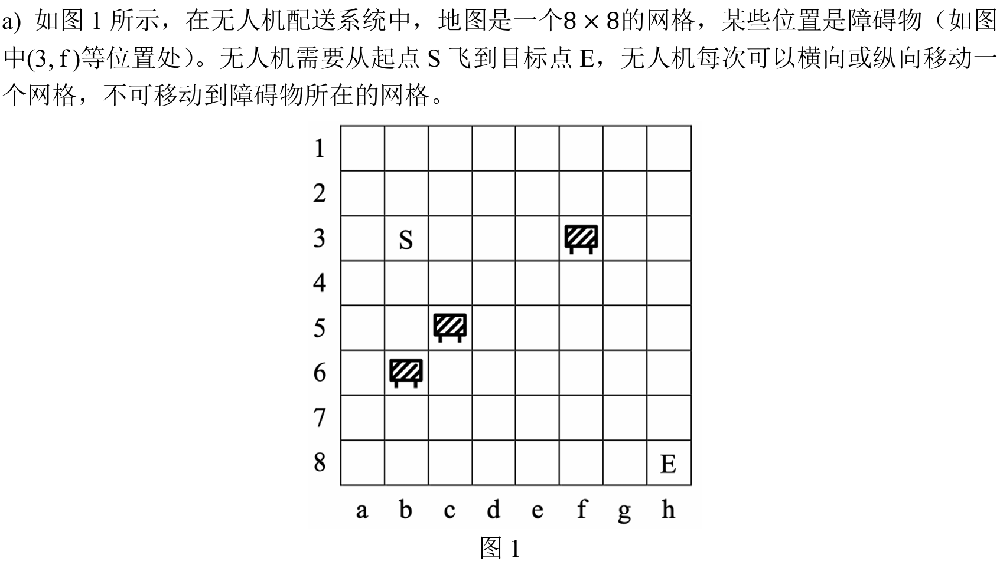
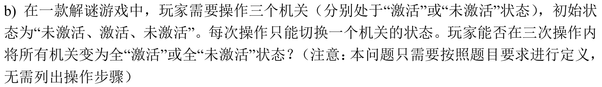
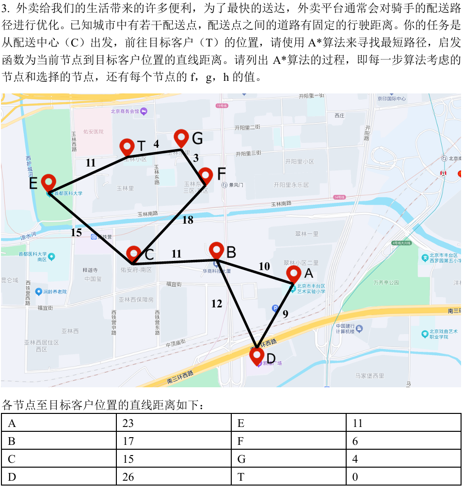
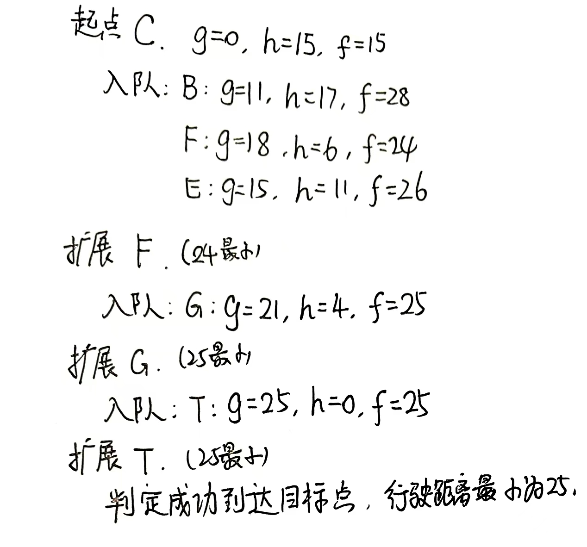

# 人工智能原理-作业1

#### Author: 夏弘宇 2023011004

## 第一题

题面描述：对于以下问题，请定义状态，初始状态，目标状态，行动，代价函数。

### 第一小问

- 状态：$(x,y)$，表示无人机所在格子的坐标，且不能是障碍物所在位置
- 初始状态：起点$S$坐标$(3,b)$
- 目标状态：终点$E$坐标$(8,h)$
- 行动：从某一格到达上下左右四个相邻格子中没有障碍物且没有超出边界的格子
- 代价函数：单个行动的代价为1，多次行动的代价为累计的行动次数

### 第二小问

- 先进行数学抽象，用三元组表示三个机关的状态$(x,y,z)$, 其中$x,y,z \in \{0,1\}$，0表示未激活，1表示激活
- 状态：$(x,y,z)$，表示三个机关的状态
- 初始状态：$(0,1,0)$
- 目标状态：两个子问题分别是$(1,1,1)$和$(0,0,0)$
- 行动：激活或者关闭一个机关，即$(x,y,z) \rightarrow (1-x,y,z)$或者$(x,1-y,z)$或者$(x,y,1-z)$
- 代价函数：单个行动的代价为1，多次行动的代价为累计的行动次数

## 第三题

### 题面描述

### 解答

