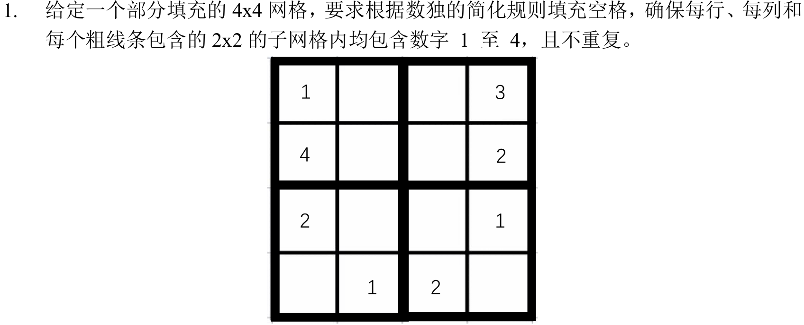
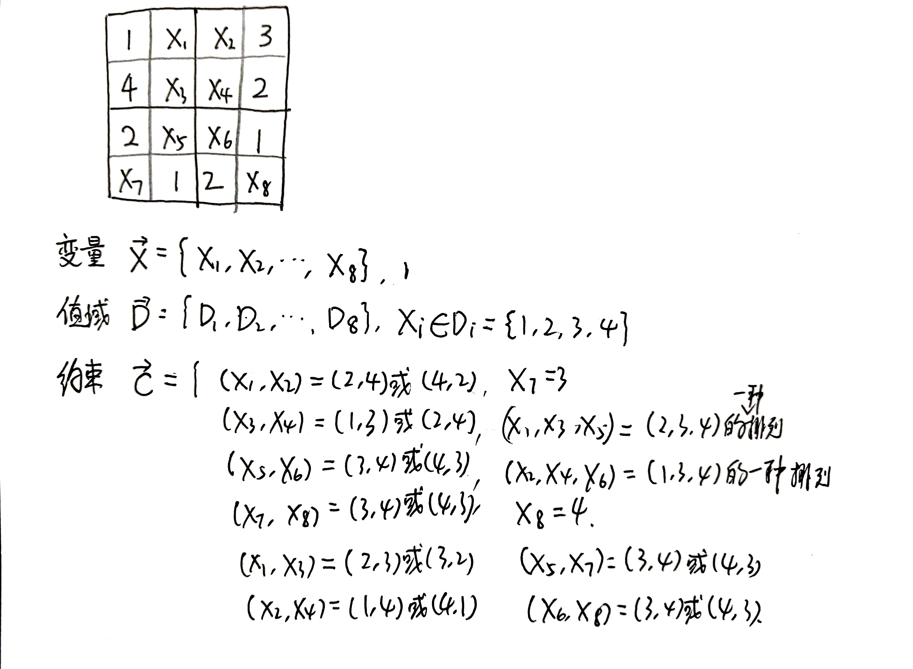
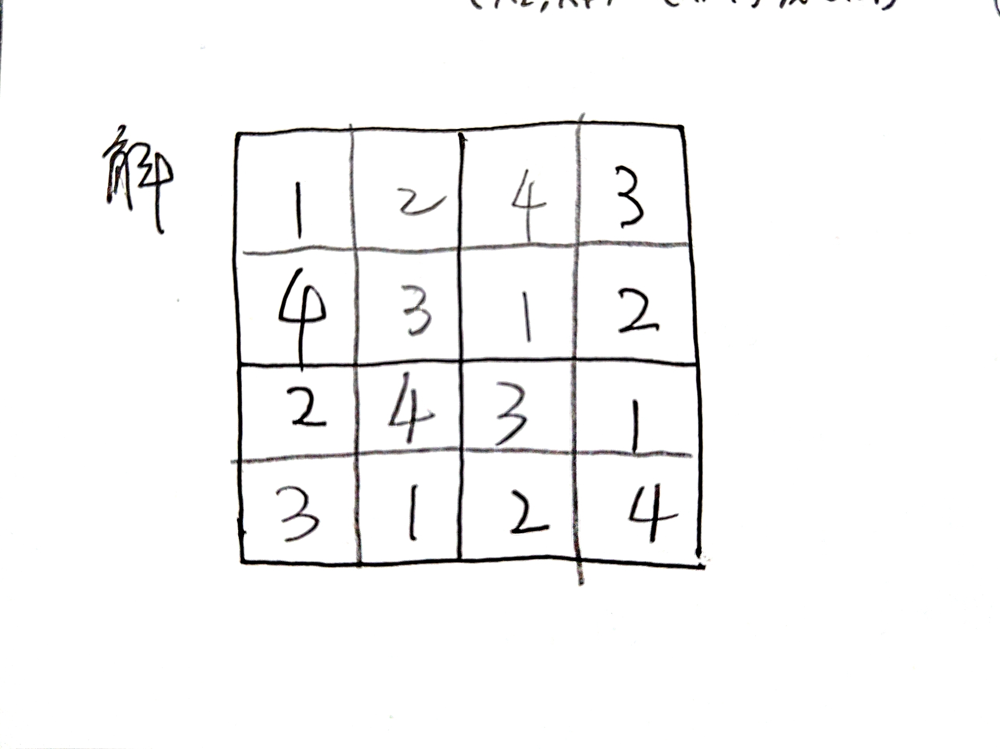
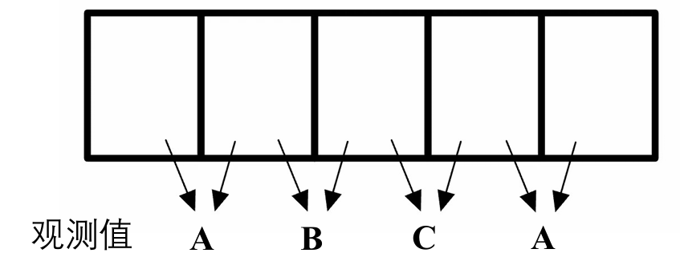
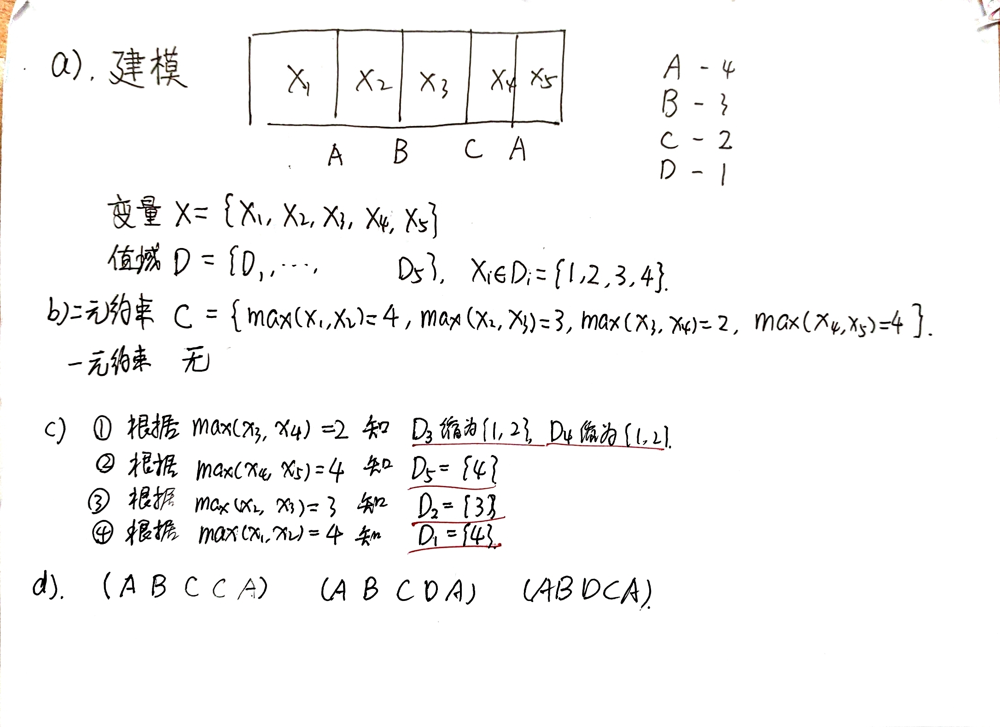

# 人工智能原理-作业2

#### Author: 夏弘宇 2023011004

## 第一题

### 第一小问：将该问题进行要素化表示，描述为约束满足问题，给出约束关系

### 第二小问：求解该数独问题，给出填充后的完整数独网格

## 第二题

### 题面描述

将A,B,C,D 四种类型的传感器放置在 1-5 的区域中，每个区域放置一个传感器。每种传感器的信号覆盖范围不同，设定信号强度A>B>C>D，相邻区域中信号强的传感器会覆盖信号较弱的传感器，即可以观测到相邻区域内较强的信号，得到的信号强度如下图所示。现考虑 5 个区域内的传感器类型及其信号观测值。

- 把该问题建模为约束满足问题，给出该问题的变量和值域。 
- 根据图中的信号观测值，给出该问题的一元约束和二元约束。 
- 根据边相容对所有的变量进行值域缩小，给出缩小的结果。 
- 给出该约束满足问题的所有解。

### 解答

