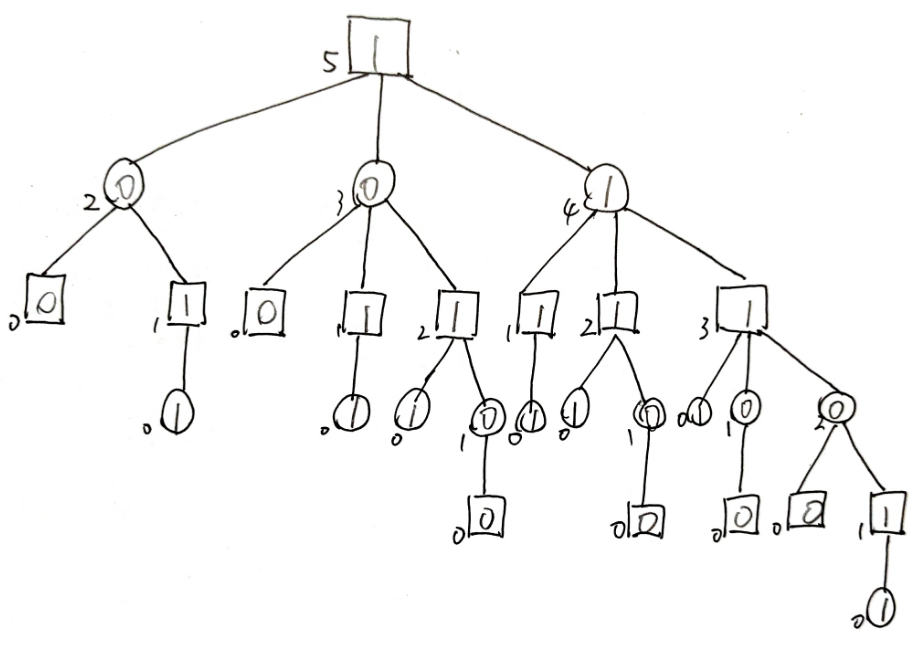

# 人工智能原理-作业3

#### Author: 夏弘宇 2023011004

## 第一题

请对如下与或树，以优先生成左边节点顺序来进行$\alpha−\beta$剪枝，在未被剪枝的方形节点（MAX节点）和圆形节点（MIN节点）内填入节点的最终估值，用“/”标记剪枝处，并用“$\alpha$”和“$\beta$”表明是哪种剪枝，求被修剪掉的叶节点的总数。

## 第二题

### 题面描述

你和机器人正在进行取石游戏，你为先手。石子共N个，每个玩家在自己的回合可以从剩余石子堆中取走1到M个石子，取走最后一颗石子的人获胜（剩余石子少于M时，可一次性取走，也视为取走者胜利）。 

- 请说明该游戏如何用极大极小搜索进行求解，并画出当 N=5, M=3时的博弈树，标注每个节点的评估值。

- 记先手输为0，赢为1，画出博弈树后，标注每个节点的评估值。

- 说明如何使用α-β剪枝来减少搜索空间，并指出哪些分支可以被剪枝
- 说明：每个节点X可以**监督**子节点的更新，如果子节点的估值不再符合X的利益（比X当前的估值大于等于/小于等于），X就可以嫌弃子节点，X掌控范围内剩下的点都不搜了。X如果是MAX层，就是α剪枝；如果是MIN层，就是β剪枝。
- 指出哪些分支可以被剪枝——如图
- 