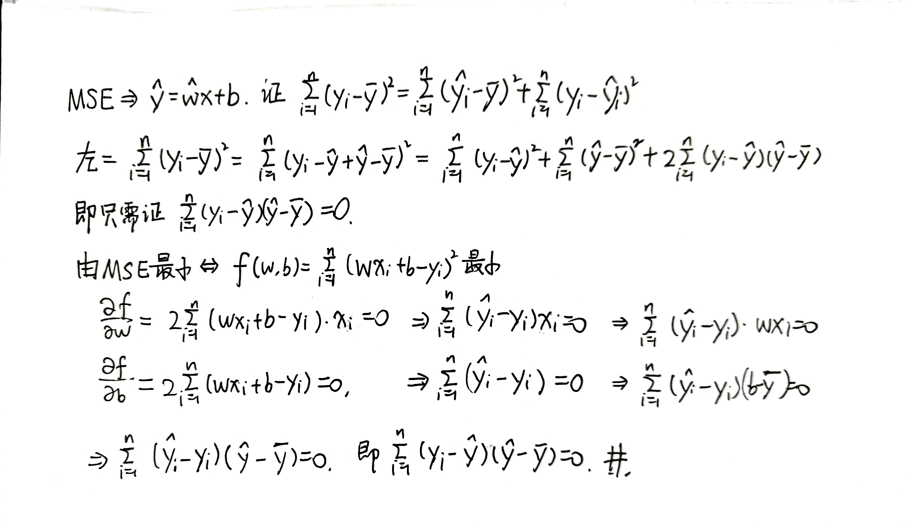
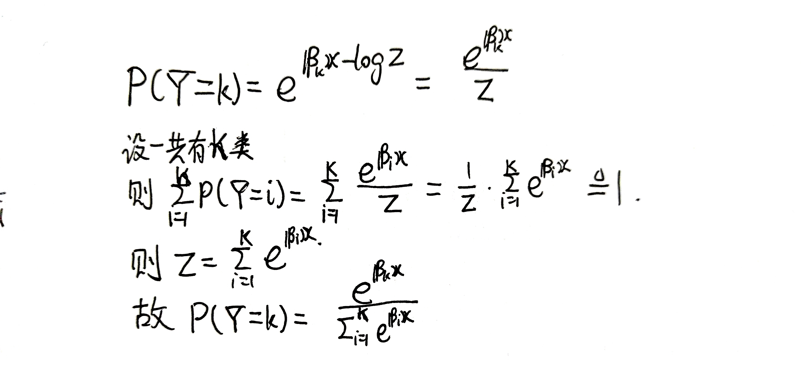
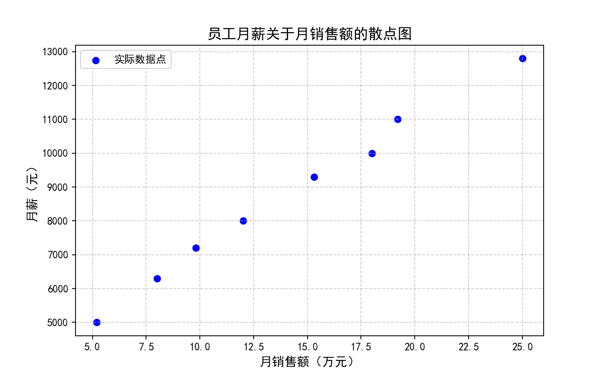

# 人工智能原理-作业4

#### Author: 夏弘宇 2023011004

## T2

在一个线性回归问题中，有n个点$(x_i, y_i)$，$i = 1,2,\ldots,n$，通过最小二乘法求得的线性回归方程为$\hat{y} = \hat{w}x + b$。需要证明以下等式成立：

$$
\sum_{i=1}^{n}(y_i - \bar{y})^2 = \sum_{i=1}^{n}(\hat{y}_i - \bar{y})^2 + \sum_{i=1}^{n}(y_i - \hat{y}_i)^2
$$

其中$\bar{y} = \frac{1}{n}\sum_{i=1}^{n}y_i$表示$y$的样本均值。

## T4

设在一个K分类问题中，一个样例预测为第k类的概率建模为如下的对数线性模型：

$$
\log P(Y = k) = \beta_k x - \log Z
$$

其中：

- $P(Y = k)$ 表示样例预测为第k类的概率
- $x$ 是输入的样例数据（特征向量）
- $\beta_k$ 为第k类的权重向量
- $-\log Z$ 是归一化项，保证所有类别的概率之和为1

证明通过该对数线性模型，预测概率的表达式为Softmax形式：

$$
P(Y = k) = \frac{e^{\beta_k x}}{\sum_{j=1}^K e^{\beta_j x}}
$$

## T1

### 题目描述

某销售公司收集了8名员工的月销售额（万元）和对应月薪（元）数据如下：

| 月销售额（万元） | 5.2  | 9.8  | 15.3 | 19.2  | 25    | 8    | 12   | 18    |
| -------- | ---- | ---- | ---- | ----- | ----- | ---- | ---- | ----- |
| 月薪（元）    | 5000 | 7200 | 9300 | 11000 | 12800 | 6300 | 8000 | 10000 |

需要完成以下分析任务：

1. 绘制散点
2. 计算线性回归方程和回归系数r²
3. 计算MAE和MSE评估模型

### （1）散点图绘制

### （2）线性回归分析

1. ​**​基础统计量计算​**​：
   
   - ∑x = 112.5
   - ∑y = 69600
   - n = 8
   - x̄ = 14.0625
   - ȳ = 8700

2. ​**​协方差计算​**​：
   ∑xy = 1096450  
   ∑x² = 1882.81  
   Cov(x,y) = (1096450 - 8×14.0625×8700)/8 = 14712.5

3. ​**​方差计算​**​：
   Var(x) = (1882.81 - 8×14.0625²)/8 = 37.5973

4. ​**​回归系数​**​：
   b = Cov(x,y)/Var(x) = 14712.5/37.5973 ≈ 391.32  
   a = ȳ - b·x̄ ≈ 3197

5. ​**​回归方程​**​：
   ŷ = 391.3x + 3197

6. ​**​回归系数r²计算​**​：
   SST = ∑(y-ȳ)² = 46340000  
   SSE = ∑(y-ŷ)² ≈ 281703.73  
   r² = 1 - SSE/SST ≈ 0.9939

7. 最终结果
- ​**​回归方程​**​：y = 391.3x + 3197
- ​**​决定系数​**​：r² = 0.9939

### （3）误差分析

MAE = (232+168+115+290+180+27+107+240)/8 ≈ 170.0  
MSE = (53824+...+57600)/8 ≈ 35190

- ​**​MAE​**​：170.0元
- ​**​MSE​**​：35190

## 结论

1. 数据呈现强线性相关性（r²=0.9939）
2. 回归方程y=391.3x+3197能很好解释月薪变化
3. 误差指标显示模型预测精度较高（MAE=170，MSE=35190）
