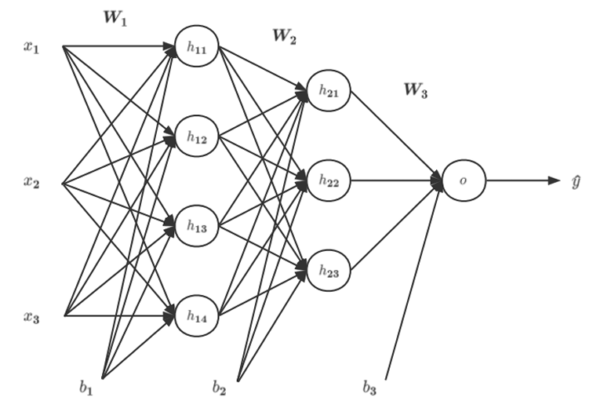

# 人工智能原理-作业5

#### Author: 夏弘宇 2023011004

## T1

### 问题描述

- 考虑含两组隐层单元的三层前馈神经网络：
  
  

$$
W_1 = \begin{bmatrix}
0.1 & 0.1 & 0.3 \\
0.2 & 0.3 & 0.2 \\
0.1 & 0.2 & 0.1 \\
0.3 & 0.1 & 0.1
\end{bmatrix}, \quad
W_2 = W_1^T, \quad
W_3 = \begin{bmatrix} 0.2 & 0.2 & 0.4 \end{bmatrix}
$$

$$
[b_1, b_2, b_3] = [0.5, 0.5, 0.2]
$$

各参数的初始值如上所示。定义该网络的隐藏层单元的激活函数为 ℎ=cos(𝑧) ，输出单元为
Logistic 函数。

### T1-1

- Q: 当输入为 $(𝑥_1, 𝑥_2, 𝑥_3) = (0.05,0.10,0.05)$ 时，计算该神经网络输出 𝑦 的值。请写明必要的计算过程。
- A:

**输入向量**  

$$
x = \begin{bmatrix} 0.05 \\ 0.10 \\ 0.05 \end{bmatrix}
$$

**第一隐藏层计算**

- **权重矩阵** $W_1$ 和 **偏置** $b_1=0.5$：
  
  $$
  W_1 = \begin{bmatrix}
0.1 & 0.1 & 0.3 \\
0.2 & 0.3 & 0.2 \\
0.1 & 0.2 & 0.1 \\
0.3 & 0.1 & 0.1
\end{bmatrix}, \quad
b_1 = 0.5
  $$

- **线性组合** $z_1 = W_1 \cdot x + b_1$：
  
  $$
  \begin{aligned}
z_1 &= \begin{bmatrix}
0.1 \cdot 0.05 + 0.1 \cdot 0.10 + 0.3 \cdot 0.05 \\
0.2 \cdot 0.05 + 0.3 \cdot 0.10 + 0.2 \cdot 0.05 \\
0.1 \cdot 0.05 + 0.2 \cdot 0.10 + 0.1 \cdot 0.05 \\
0.3 \cdot 0.05 + 0.1 \cdot 0.10 + 0.1 \cdot 0.05
\end{bmatrix} + 0.5 \\
&= \begin{bmatrix}
0.005 + 0.010 + 0.015 \\
0.010 + 0.030 + 0.010 \\
0.005 + 0.020 + 0.005 \\
0.015 + 0.010 + 0.005
\end{bmatrix} + 0.5 \\
&= \begin{bmatrix} 0.03 \\ 0.05 \\ 0.03 \\ 0.03 \end{bmatrix} + 0.5 = \begin{bmatrix} 0.53 \\ 0.55 \\ 0.53 \\ 0.53 \end{bmatrix}
\end{aligned}
  $$

- **激活函数** $a_1 = \cos(z_1)$：
  
  $$
  a_1 = \begin{bmatrix}
\cos(0.53) \\
\cos(0.55) \\
\cos(0.53) \\
\cos(0.53)
\end{bmatrix} \approx \begin{bmatrix} 0.862 \\ 0.853 \\ 0.862 \\ 0.862 \end{bmatrix}
  $$

**第二隐藏层计算**

- **权重矩阵** $W_2 = W_1^T$ 和 **偏置** $b_2=0.5$：
  
  $$
  W_2 = \begin{bmatrix}
0.1 & 0.2 & 0.1 & 0.3 \\
0.1 & 0.3 & 0.2 & 0.1 \\
0.3 & 0.2 & 0.1 & 0.1
\end{bmatrix}, \quad
b_2 = 0.5
  $$

- **线性组合** $z_2 = W_2 \cdot a_1 + b_2$：
  
  $$
  \begin{aligned}
z_2 &= \begin{bmatrix}
0.1 \cdot 0.862 + 0.2 \cdot 0.853 + 0.1 \cdot 0.862 + 0.3 \cdot 0.862 \\
0.1 \cdot 0.862 + 0.3 \cdot 0.853 + 0.2 \cdot 0.862 + 0.1 \cdot 0.862 \\
0.3 \cdot 0.862 + 0.2 \cdot 0.853 + 0.1 \cdot 0.862 + 0.1 \cdot 0.862
\end{bmatrix} + 0.5 \\
&= \begin{bmatrix}
0.0862 + 0.1706 + 0.0862 + 0.2586 \\
0.0862 + 0.2559 + 0.1724 + 0.0862 \\
0.2586 + 0.1706 + 0.0862 + 0.0862
\end{bmatrix} + 0.5 \\
&= \begin{bmatrix} 0.6016 \\ 0.6007 \\ 0.6016 \end{bmatrix} + 0.5 = \begin{bmatrix} 1.102 \\ 1.101 \\ 1.102 \end{bmatrix}
\end{aligned}
  $$

- **激活函数** $a_2 = \cos(z_2)$：
  
  $$
  a_2 = \begin{bmatrix}
\cos(1.102) \\
\cos(1.101) \\
\cos(1.102)
\end{bmatrix} \approx \begin{bmatrix} 0.452 \\ 0.453 \\ 0.452 \end{bmatrix}
  $$

**输出层计算**

- **权重矩阵** $W_3$ 和 **偏置** $b_3=0.2$：
  
  $$
  W_3 = \begin{bmatrix} 0.2 & 0.2 & 0.4 \end{bmatrix}, \quad
b_3 = 0.2
  $$

- **线性组合** $z_3 = W_3 \cdot a_2 + b_3$：
  
  $$
  \begin{aligned}
z_3 &= 0.2 \cdot 0.452 + 0.2 \cdot 0.453 + 0.4 \cdot 0.452 + 0.2 \\
&= 0.0904 + 0.0906 + 0.1808 + 0.2 \\
&= 0.562
\end{aligned}
  $$

- **Logistic 函数** $\sigma(z_3) = \frac{1}{1 + e^{-z_3}}$：
  
  $$
  \sigma(0.562) = \frac{1}{1 + e^{-0.562}} \approx \frac{1}{1 + 0.570} \approx 0.637
  $$

**最终输出**  

$$
\hat{y} \approx 0.637
$$

### T1-2

- Q: 在T1-1的基础上，若𝑦=0.95，采用最小化均方误差作为优化准则，请根据BP算法计算参数$𝑊_3$的梯度。

- A:
1. **输出层误差计算**  
   均方误差损失函数：（问了王子安助教，答曰系数不要紧，故按照自己之前学的乘了二分之一）
   
   $$
   E = \frac{1}{2}(\hat{y} - y)^2
   $$
   
   Logistic函数导数：
   
   $$
   \sigma'(z_3) = \sigma(z_3)(1-\sigma(z_3)) = \hat{y}(1-\hat{y})
   $$
   
   输出层误差项：
   
   $$
   \delta_3 = \frac{\partial E}{\partial z_3} = (\hat{y} - y) \cdot \sigma'(z_3) = (0.637 - 0.95) \times 0.637 \times (1-0.637)
   $$
   
   $$
   = (-0.313) \times 0.637 \times 0.363 \approx -0.0724
   $$

2. **$W_3$ 梯度计算**  
   
   $$
   \frac{\partial E}{\partial W_3} = \frac{\partial E}{\partial z_3} \cdot \frac{\partial z_3}{\partial W_3} = \delta_3 \cdot a_2^T = -0.0724 \times \begin{bmatrix} 0.452 & 0.453 & 0.452 \end{bmatrix}
   $$
   
   $$
   \approx \begin{bmatrix} -0.0327 & -0.0328 & -0.0327 \end{bmatrix}
   $$

3. **梯度结果**  
   $W_3$ 的梯度为：
   
   $$
   \nabla W_3 = \begin{bmatrix} -0.0327 & -0.0328 & -0.0327 \end{bmatrix}
   $$

### T1-3

- Q: 在T1-2的基础上，若采用梯度下降更新参数，且学习率设置为0.1，写出更新后的参数$𝑊_3$。

- A:
  
  $$
  W_3^{new} = W_3 - \eta \cdot \nabla W_3\\\
 \begin{aligned}
 w_{3,1}^{new} &= 0.2 - 0.1 \times (-0.0327) \approx 0.2033 \\
 w_{3,2}^{new} &= 0.2 - 0.1 \times (-0.0328) \approx 0.2033 \\
 w_{3,3}^{new} &= 0.4 - 0.1 \times (-0.0327) \approx 0.4033 
\end{aligned}\\\
 W_3^{new} = \begin{bmatrix} 0.2033 & 0.2033 & 0.4033 \end{bmatrix}
  $$
  
  

## T4

### 问题描述

尝试对单个时间步的LSTM网络进行权值更新。已知输入值xt、上一时刻的输出状态
ht-1、记忆状态Ct-1、初始参数向量θ0（包括输入门it、遗忘门ft、输出门ot、候选记忆
C̃t等门控单元的权重矩阵W）和理论输出值d分别为：

- 输入值xt = [1]
- 上一时刻的输出状态ht-1 = [0]，记忆状态Ct-1 = [0]
- 初始参数Wf = [0.5,0.5]，Wi = [0.4,0.4]，Wo = [0.5,0.5]，WC = [0.4,0.4]，不考虑偏置项
- 理论输出值d = 0.6

### T4-1

Q: 标准LSTM单元如图所示，其中σ代表Sigmoid函数，请你根据如下公式进行前向传播，计算输出值ht和记忆状态$C_t$。

$$
\begin{aligned}
f_t &= \sigma(\textbf{W}_f \times [\textbf{h}_{t-1}, \textbf{x}_t]) \\
i_t &= \sigma(\textbf{W}_i \times [\textbf{h}_{t-1}, \textbf{x}_t]) \\
\tilde{\textbf{C}}_t &= \tanh(\textbf{W}_C \times [\textbf{h}_{t-1}, \textbf{x}_t]) \\
o_t &= \sigma(\textbf{W}_o \times [\textbf{h}_{t-1}, \textbf{x}_t]) \\
\textbf{C}_t &= f_t \times \textbf{C}_{t-1} + i_t \times \tilde{\textbf{C}}_t \\
\textbf{h}_t &= o_t \times \tanh(\textbf{C}_t)
\end{aligned}
$$

A:

$$
[h_{t-1}, x_t] = [0, 1]\\
 
 
 f_t = \sigma(0.5 \times 0 + 0.5 \times 1) = 0.6225\\
 
 
 i_t = \sigma(0.4 \times 0 + 0.4 \times 1) = 0.5987\\
 
 
 \tilde{C}_t = \tanh(0.4 \times 0 + 0.4 \times 1) = 0.3799\\
 
 
 C_t = 0.6225 \times 0 + 0.5987 \times 0.3799 = 0.2274\\
 
 
 o_t = \sigma(0.5 \times 0 + 0.5 \times 1) = 0.6225\\
 
 
 h_t = 0.6225 \times \tanh(0.2274) = 0.1393
$$

   $$
   
   $$

### T4-2

Q: 假设损失函数为$L = \frac{1}{2}(y - d)^2$，
学习率为α = 0.1，其中y代表当前时间步的网络输出，即ht，请你进行反向传播更新$𝑊_𝑜$的权重。

A:

$$
\frac{\partial L}{\partial h_t} = h_t - d = 0.1393 - 0.6000 = -0.4607\\
\frac{\partial h_t}{\partial o_t} = \tanh(C_t) = 0.2237\\
\frac{\partial o_t}{\partial z_o} = o_t(1-o_t) = 0.2350\\
\frac{\partial L}{\partial W_o} = \begin{bmatrix}
 0 \\ 
-0.4607 \times 0.2237 \times 0.2350 \times 1
 \end{bmatrix} = \begin{bmatrix} 0 \\ -0.0242 \end{bmatrix}\\
 W_o^{\text{new}} = \begin{bmatrix} 0.5000 \\ 0.5000 \end{bmatrix} - 0.1 \times \begin{bmatrix} 0 \\ -0.0242 \end{bmatrix} = \begin{bmatrix} 0.5000 \\ 0.5024 \end{bmatrix}
$$

   