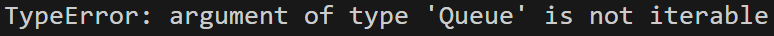

# 编程作业一_天元鼎问题报告

## Author: 夏弘宇 2023011004

## 0.基本功能实现（核心代码解释）

移动规则基本都在actions这个函数中涵盖了：

```python
def actions(self, state):#返回所有合法的动作，以空格的去向表示
    empty_row, empty_col = np.where(np.array(state) == 0)[0][0], np.where(np.array(state) == 0)[1][0] #找到空格的位置
    candidates = [[empty_row-1, empty_col], [empty_row+1, empty_col],
                    [empty_row, empty_col-1], [empty_row, empty_col+1],]                              #基本规则：可以上下左右移动
    valid_candidates = [item for item in candidates if self.is_valid(item)]                           #判断是否越界

    ab_pos = [np.where(np.array(state) == 5)[0][0], np.where(np.array(state) == 5)[1][0]]             #敖丙技能实现
    if ab_pos not in valid_candidates:
        valid_candidates.append(ab_pos)

    nz1_pos = [np.where(np.array(state) == 3)[0][0], np.where(np.array(state) == 3)[1][0]]            #哪吒约束实现
    nz2_pos = [np.where(np.array(state) == 4)[0][0], np.where(np.array(state) == 4)[1][0]]
    if nz1_pos in valid_candidates:
        if Mannhattan_distance([empty_row, empty_col], nz2_pos) > 4:
            valid_candidates.remove(nz1_pos)
    if nz2_pos in valid_candidates:
        if Mannhattan_distance([empty_row, empty_col], nz1_pos) > 4:
            valid_candidates.remove(nz2_pos)
    return valid_candidates
```

## 1.无信息搜索（核心代码解释）

为找到步数最少（最优的方案），无信息搜索采用BFS的方法。

课件中提供的算法分了open表和closed表，分别用来存队列中的元素，以及搜过的元素。但运行时，判定某元素是否在opne表中存在问题：


于是我开了一个open_closed的set，可以同时判断元素是否在open表中，以及是否在closed表中，这样open作为一个队列，closed_open作为一个集合，分工比较明确！

下面是搜索的核心代码：

```python
open = Queue()                             #开一个队列
open.push(problem.init_state)              #队列中插入初始状态
closed_open = set()                        #开一个搜过点的集合
while not open.empty():
    node = open.pop()                      #队首取出一个点（符合贪心策略，取出目前所需步数最少的能到达的点）
    if problem.is_goal(node.state):
        #搜索成功，输出等操作
        return
    for child in problem.expand(node):
        if child.state not in closed_open: #还没搜过
            open.push(child)               #插入队列
            closed_open.add(child.state)   #插入set
```

## 2.A*搜索（启发函数设计）

第一个差异：由于启发函数的介入，入队的顺序未必按评价函数从小到大来，所以要用一个优先队列来代替普通队列；主程序中没别的差异，就不贴代码了。

第二个关键：启发函数的设计。启发函数的设计是A*搜索的关键，它决定了搜索的效率和结果的优劣。在这个问题中，我设计了三个启发函数：

1. h0：返回0，等价于BFS
2. h1：返回不在目标位置上的2~6角色个数，可以得出最优解
3. h2：返回当前2-4,6到格的曼哈顿距离和，如果5不在目标位置的话再+1，这个函数保证比实际所需步数少，是最优解

注：启发函数代码篇幅大，且实现上没啥技术含量，就不贴代码了

## 3.四种算法的比较（优劣与原因）

```
无信息：搜索时间为37.00s, 搜索节点数为370984个, 最佳方案步数为19
h0:  搜索时间为37.29s, 搜索节点数为370984个, 最佳方案步数为19
h1:  搜索时间为26.00s, 搜索节点数为91222个, 最佳方案步数为19
h2:  搜索时间为6.03s, 搜索节点数为23112个, 最佳方案步数为19
```

以最优解为标准，上述各种方案均达到最小步数18（输出19是把原始状态算入了）

由运行时间和搜索节点数，不难发现，h2是最优的启发函数。h1次之，h0和无信息搜索差不多。

原因：h0和无信息搜索本质上是一致的，h恒等于0也就是没有启发函数，实际上h0在实际运行时还会增加使用堆产生的一个log复杂度，所以耗时上会更长一些。

h1是一个初级的启发函数，满足可采纳性的条件，且会提供一些未来开销的有效信息，因此在无信息搜索的基础上产生了性能较大的提升；尽管搜的点数减少到了无信息搜索的1/4，但时间上没减少那么多，这主要因为启发函数的计算也需要一定的时间消耗。

h2是比h1占优的启发函数，事实上h1相当于把h2中大于1的数都变成1，所以h2的值是大于等于h1的值，也就是h2比h1 占优，实际运行过程中也可以看到性能进一步有了较大的提升！

## 4.题外话

一开始突发奇想，可以在启发函数中加入随机噪声，结果确实会在性能上产生波动，最少只需要<10000个点就搜到了。但这样的启发函数不是最优解，而且在波动过程中也会产生性能更差的情况，所以不推荐这样的启发函数。
