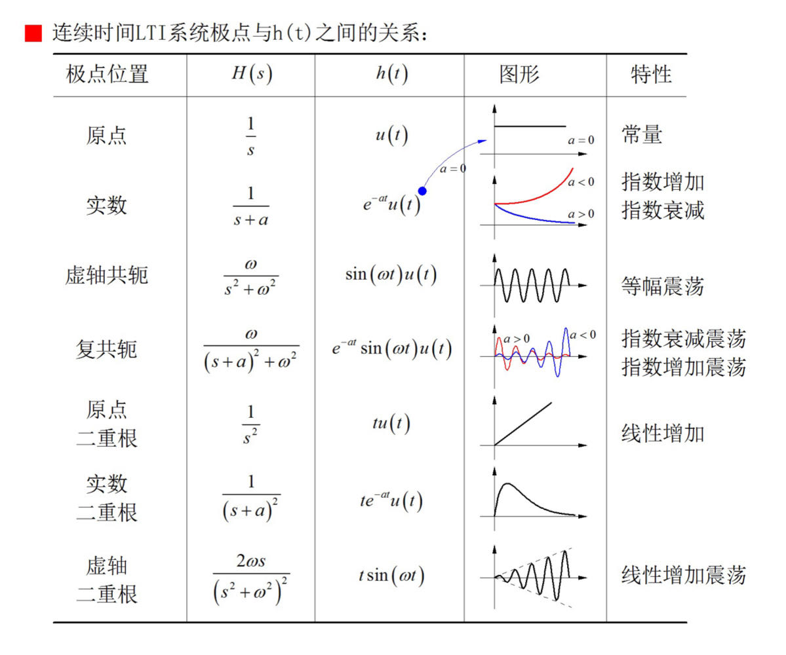
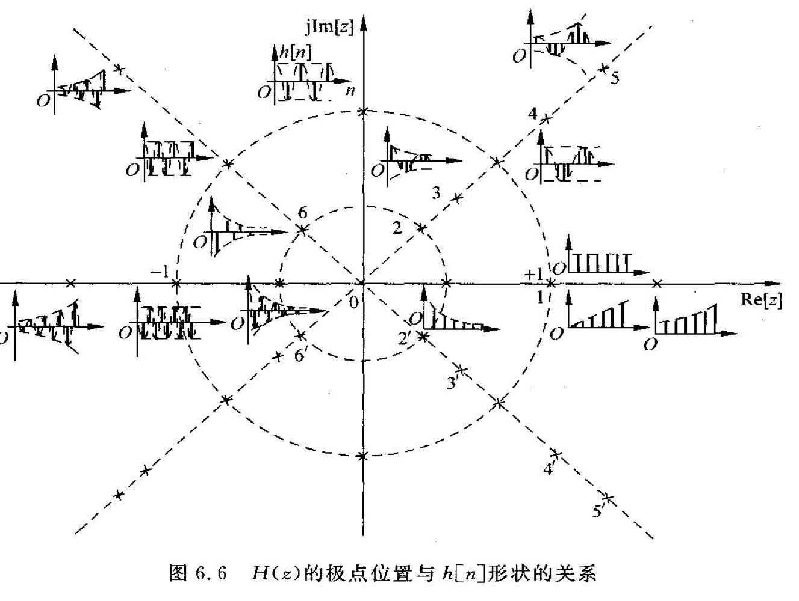
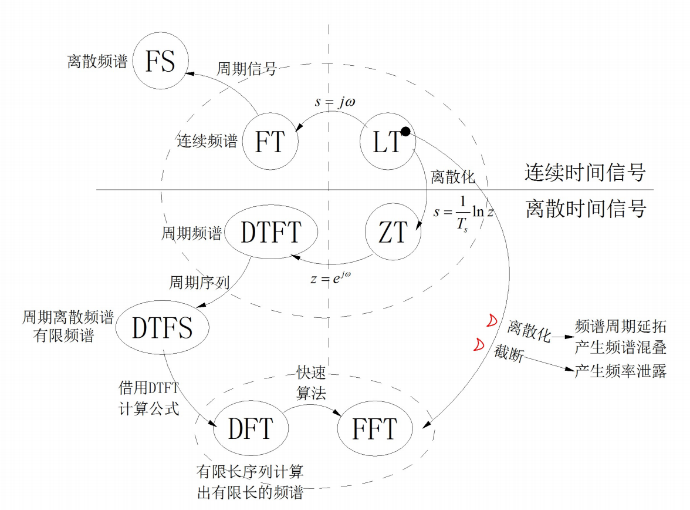
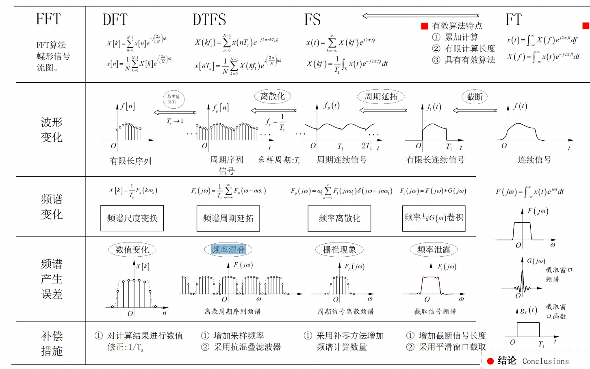

## 1.1 连续时间信号

##### 信号分类

1. 确定性信号：确定的函数形式 (对应随机信号)

2. 连续时间信号：任何时刻都有对应函数值 (对应离散时间信号)

3. 数字信号：输出离散 (对应模拟信号)
   
   低通滤波(数连$\to$模连)；信号采样(模连$\to$模离)；
   信号恢复(模离$\to$模连)；数值量化(模离$\to$数离)；零阶保持(数离$\to$数连)

4. 周期信号：$f(t)-f(t+nT)$ (伪随机信号)
   
   非周期信号：e.g.两个信号周期之比不是有理数 (混沌信号)

5. 能量(有限)信号： (周期、阶跃能量无穷大)
   
   $E= \int ^{\infty} _{-\infty} f(t)^2dt$ ; $E = \Sigma ^{\infty} _{n=-\infty} |x[n]|^2$

6. 功率(有限)信号：信号平均功率定义为信号电压/电流在1 $\Omega$ 电阻上消耗的功率
   
    $P = \lim_{T\to\infty} \frac{1}{T} \int ^{\frac{T}{2}} _{-\frac{T}{2}} f(t)^2dt$ ; $P = \lim_{N\to\infty} \frac{1}{2N + 1} \Sigma ^{N} _{-N} |x[n]|^2$

##### 基本信号

1. 指数信号 $f(t)=Ke^{at}$ ; a>0信号增长; a<0信号衰减

2. 正弦信号 $f(t)=K\sin(\omega t + \theta)$
   
   $\sin(\omega t) = \frac{1}{2j}(e^{j \omega t} - e^{-j \omega t}); \cos(\omega t) = \frac{1}{2}(e^{j \omega t} + e^{-j \omega t})$
   
   $e^{j \omega t} = \cos(\omega t) + j\sin(\omega t);e^{-j \omega t} = \cos(\omega t) - j\sin(\omega t);$

3. 采样信号 $Sa(t) = \frac{\sin(t)}{t}$ ； 偶函数；$t = \pm \pi, \pm 2 \pi, ...$时$Sa(t)=0$；
   $\int ^{\infty} _{-\infty} Sa(t)dt = \pi;\int ^{\infty} _{0} Sa(t)dt = \frac{\pi}{2}$；$\frac{1}{t}$ 大体衰减趋势；$Si(y)=\int^{y}_{-\infty}Sa(t)dt$

4. 高斯函数 $f(t)=E \cdot e^{-(\frac{t}{\sigma})^2};$
   
   $\int ^{\infty} _{-\infty} e^{-t^2}dt = \sqrt{\pi};E(t)=\int ^{t} _{-\infty} e^{-t^2}dt$ 误差函数

5. 复指数信号(真实不存在) $f(t) = Ke^{st} = Ke^{(\sigma + j\omega)t}$

|             | 直流   | 指数     | 正弦     | 余弦     | 幅值变化   | 幅值变化   |
|:-----------:| ---- | ------ | ------ | ------ | ------ | ------ |
| $\omega$    | 0    | 0      | $\ne0$ | $\ne0$ | $\ne0$ | $\ne0$ |
| $\sigma$    | 0    | $\ne0$ | 0      | 0      | >0     | <0     |
| Re{} / Im{} | Re{} | Re{}   | Re{}   | Im{}   | 增长     | 衰减     |

##### 奇异信号

不连续函数 / 其导数不连续

1. 单位阶跃信号 $u(t)$

2. 单位斜变信号 $f(t) = t, t\ge 0$

3. 符号函数 $sgn(t) = 2u(t) - 1 = u(t) - u(-t)$

4. 单位脉冲信号 $\delta (t) = \lim_{\tau\to0}\frac{1}{\tau}[u(t+\frac{\tau}{2})-u(t-\frac{\tau}{2})]$
   
   1. $\int ^{\infty} _{-\infty} \delta (t)dt = 1; \delta (t) = 0, t \ne 0$ 狄拉克(Dirac)定义
   
   2. $\int ^{\infty} _{-\infty} \delta (t-t_0)f(t)dt = f(t_0); \delta (t)f(t) = \delta(t)f(0)$ 分配函数定义 抽样特性
   
   3. $\delta(t) = \delta(-t);\delta'(t) = -\delta'(-t)$
   
   4. $\delta(t) = \lim_{\tau\to0}Z_\tau(t);\int ^{\tau} _{-\tau}Z_\tau(t)dt = 1$
   
   5. $u(t)=\int ^t _{-\infty} \delta(\tau)d\tau; \int ^{\infty} _{0} \delta(t-\sigma)d\sigma = u(t)$
   
   6. $\delta(at) = \frac{1}{|a|}\delta(t)$
   
   7. $\delta'(t)=\lim_{\tau\to0}\frac{1}{\tau}[\delta(t+\frac{\tau}{2})-\delta(t-\frac{\tau}{2})]$ 
   
   8. $\delta'(0_-) = + \infty ; \delta'(0_+) = - \infty$
   
   9. $\int ^{\infty} _{-\infty} \delta' (t)dt = 0; \delta(t)=\int ^t _{-\infty} \delta'(\tau)d\tau$
   
   10. $\int ^{\infty} _{-\infty} \delta' (t-t_0)f(t)dt = -f'(t_0)$ 抽样特性
   
   11. $\delta '(t)f(t) = \delta'(t)f(0) - f'(0)\delta(t)$ 抽样特性
   
   12. 抽样周期序列
       
       1. $\delta_T(t) = \Sigma ^{\infty} _ {-\infty} \delta(t - nT)$
       
       2. $\delta_T(t) \xrightarrow{FT} \omega_1\Sigma ^{\infty} _ {-\infty} \delta(\omega - n\omega _1)$
       
       3. $f_s(t) = f(t) \cdot \delta_T(t)$

##### 信号分解 (正交分解、能量守恒)

1. 直流+交流
   
   $f_D(t) = \frac{1}{T}\int ^{\frac{T}{2}} _{-\frac{T}{2}} f(t)dt ; P = P_D + P_A$

2. 偶分量+奇分量
   
   $f_e(t)=\frac{1}{2}[f(t)+f(-t)];f_o(t)=\frac{1}{2}[f(t)-f(-t)]$

3. 实部分量+虚部分量
   
   $f_r(t)=\frac{1}{2}[f(t)+f^*(t)];$   $jf_i(t)=\frac{1}{2}[f(t)-f^*(t)]$
   
   $|f(t)|^2 = f(t)f^*(t)=f_r^2(t)+f_i^2(t)$

4. 脉冲分解 (i.e.抽样特性)
   
   $x[n] = \Sigma ^{\infty} _{k=- \infty} x[k]\delta[n-k]$
   
   $f(t) = \int ^{\infty} _{-\infty} f(\tau)\delta(t-\tau)d\tau$

5. 周期信号级数分解

6. 复指数信号分解

## 1.2 离散时间信号

##### 基本信号

1. 单位阶跃序列 $u[n]$ ($u[0] = 1 \ne 0.5$)

2. 单位斜变序列 $x[n]=nu[n]$

3. 单位脉冲序列 (单位样值序列)  $\delta[n]$
   
   1. $\delta[n] = u[n] - u[n-1]$
   
   2. $u[n]=\Sigma ^{\infty} _{m=0} \delta[n-m]$
   
   3. $u[n]=\Sigma ^{n} _{m=-\infty} \delta[m]$
   
   4. $x[n]\delta[n]=x[0]\delta[n]$
   
   5. $\delta[0]=1 \ne \infty$

4. 指数序列 $x[n] = \alpha^n u[n]$

5. 复指数信号 $x[n]=e^{j\Omega n} = \cos[\Omega n] + j\sin[\Omega n]$
   
   1. 低频/慢变化序列发生在 $\pi$ 的偶数倍附近
   
   2. 高频/快变化序列发生在 $\pi$ 的奇数倍附近
   
   3. 不一定是周期信号，要求 $\frac{\Omega}{2\pi}= \frac{m}{n}$ (有理数) 周期：mn；m,n互质
   
   4. 基波周期N；基波频率 $\frac{2\pi}{N}$
   
   5. 归一化频率 $\omega _0 = \frac{\Omega _0}{f_s} = \Omega _0 T_s$

## 1.3 信号的基本运算

1. 加法、乘法运算

2. 微分、差分运算 (突出边缘、变化、噪声增加)
   
   $\bigtriangledown ^k x[n] = \bigtriangledown ^{k-1} x[n] - \bigtriangledown ^{k-1} x[n-1]$ (k阶后向差分运算)
   
   $\bigtriangleup x[n] = x[n+1] - x[n]$ (一阶前向差分运算)

3. 积分、累加运算 (噪声减少、累积平均)
   
   $y(t) = \int ^{t} _{-\infty} x(\tau) d\tau; y[n] = \Sigma ^{n} _{k=- \infty} x[k]$

4. 比例换算
   
   连续： $y(t) =x(at);$ $|a| > 1$ 表示波形在时间轴上压缩为原来的 $\frac{1}{|a|}$
   
   离散：$y[n]=x[kn];$ $k>1$ 会丢失一些样本值；$k<1$ 需要内插零运算

5. 反褶 (时间反转)
   
   其符号表示请复习ppt

## 1.4 系统

系统基本作用：对输入信号作出响应，并产生出另外的信号。

系统分类：

| 种类       | 特点                                                                                                              |
|:--------:|:---------------------------------------------------------------------------------------------------------------:|
| 即时/动态系统  | 即时系统用代数方程描述 (包括恒等系统)；即时系统$h(t)=c\delta(t)$；<br/动态系统用微分(差分)方程描述；                                                 |
| 线性/非线性系统 | 同时满足叠加性和齐次性，若$x_1(t)\rightarrow y_1(t)$，$x_2(t)\rightarrow y_2(t)$则$ax_1(t)+bx_2(t)\rightarrow ay_1(t)+by_2(t)$ |
| 时变/时不变系统 | 输入信号有时移时，输出响应也产生同样时移，若$x(t)\rightarrow y(t)$则$x(t-t_0)\rightarrow y(t-t_0)$；反褶与尺度操作都有时变特性                       |
| 可逆/不可逆系统 | 输入输出一一对应，$h_0(t)*h_-(t)=\delta(t) $或 $h_0[n]*h_-[n]=\delta[n]$                                                  |
| 因果/非因果系统 | 输出与以后的输入无关； 具有因果性的线性时不变系统，$h(t)=0, t<0$，即因果信号                                                               |
| 稳定/非稳定系统 | 输入有界则输出也有界；$\int^\infty_{-\infty}\|h(\tau)\|d\tau<\infty$                                                       |
| 线性增量系统   | 1.系统响应可分为零状态响应和零输入相应    2.零状态响应与输入成线性    3.零输入相应与零状态响应成线性                                                       |

##### LTI系统性质

线性、时不变、微分/积分特性、子系统交换律、子系统结合律、子系统分配律

## 2.1 特解通解形式求解微分方程/差分方程

| 系统   | 连续时间系统                                                                                                            | 离散时间系统                                                                                                             |
| ---- |:----------------------------------------------------------------------------------------------------------------- | ------------------------------------------------------------------------------------------------------------------ |
| 方程名称 | 微分方程                                                                                                              | 差分方程                                                                                                               |
| 方程式  | $\sum_{k=0}^Na_k\frac{d^k}{dt^k}y(t)=\sum_{k=0}^Mb_k\frac{d^k}{dt^k}x(t)$                                         | $\sum_{k=0}^Na_ky[n-k]=\sum_{k=0}^Mb_kx[n-k]$                                                                      |
| 齐次方程 | $\sum_{k=0}^Na_k\frac{d^k}{dt^k}y_h(t)$=0                                                                         | $\sum_{k=0}^Na_ky_h[n-k]=0$                                                                                        |
| 特征方程 | $\sum_{k=0}^Na_ka^k$=0                                                                                            | $\sum_{k=0}^Na_ka^{N-k}$=0                                                                                         |
| 齐次解  | 特征根$a_i$为单根时$y_h(t)=\sum_{i=1}^Nc_ie^{a_it} $ $a_j$是特征方程的k重根时，上式中与$a^j$对应的项变为$\sum_{i=0}^{k-1}d_it^ie^{a_jt}$ | 特征根$a_i$为单根时  $y_h[n]=\sum_{i=1}^Nc_ia_i^n$ $a_j$是特征方程的k重根时， 上式中与$a^j$对应的项变为$\sum_{i=0}^{k-1}d_in^ia_j^n$ |

常用输入信号的**特解**形式：

| x(t)            | $y_p(t)$                                   | x[n]                  | $y_p(n)$                                     |
| --------------- | ------------------------------------------ | --------------------- | -------------------------------------------- |
| E(常数）           | C(常数)                                      | E(常数）                 | C(常数)                                        |
| $\cos(wt+\phi)$ | $c_1\cos(wt)+c_2\sin(wt)$                  | $\cos(\Omega n+\phi)$ | $c_1\cos(\Omega n)+c_2\sin(\Omega n)$        |
| $\sin(wt+\phi)$ | $c_1\cos(wt)+c_2\sin(wt)$                  | $\sin(\Omega n+\phi)$ | $c_1\cos(\Omega n)+c_2\sin(\Omega n)$        |
| $e^{at}$        | $ce^{at}$，$a$不是方程的特征根                      | $a^n$                 | $ca^n$，$a$不是方程的特征根                           |
| $e^{at}$        | $(c_0t+c_1)e^{at}$  $a$是方程的单特征根        | $a^n$                 | $(c_0n+c_1)a^{n}$ a是a是方程的单特征根            |
| $e^{at}$        | $\sum_{i=0}^kc_it^ie^{at}$ $a$是方程的k重特征根 | $a^n$                 | $\sum_{i=0}^kc_in^ia^{n}$   $a$是方程的k重特征根 |
| $t^n$           | $\sum_{i=0}^nc_it^i$                       | $n^k$                 | $\sum_{i=0}^kc_in^i$                         |

## 2.2 零输入响应$y_{zi}(t)$和零状态响应$y_{zs}(t)$

***零输入响应***：只包含齐次解且系统输出在0时刻不跳变

- 微分方程：利用求得的齐次解的形式，利用$y^{(n)}(0_-)=y^{(n)}(0_+)$求得待定系数值即可

- 差分方程：只有齐次解部分，由于无输入，直接代入$y[-2],y[-1]$求出待定系数即可

***零状态响应***: 零状态响应时有$y^{(n)}(t)|_{t=0_-}=0$

- 微分方程：可以利用$y_{zs}(t)=y(t)-y_{zi}(t)$求得零状态响应

- 差分方程：由$y[-2]=y[-1]=0$求出$y[0],y[1]$再代入求值或是利用$y_{zs}(t)=y(t)-y_{zi}(t)$ 求得零状态响应

## 2.3 Laplace变换求解微分方程，Z变换求解差分方程

***微分方程***：将方程两边同时求Laplace变换，由已知的$y^{(n)}(0)$值可以解出$Y(s)$，然后利用反演公式将$Y(s)$转换成$y(t)$即可。注：$f(t)\leftrightarrow F(s)，\frac{df(t)}{dt}\leftrightarrow sF(s)-f(0^-)，\frac{d^2f(t)}{dt^2} \leftrightarrow s^2F(s)-sf(0^-)-f'(0^-)$

***差分方程***：左右同时取 z 变换，利用 z 变换的位移特性， 便可以得到一个代数方程， 其中的 $Y(z)$ 是方程的解， 通过求解代数方程， 便可以的得到差分方程的解对应的 z 变换 ,然后求解$Y(z)$的反变换即可。注：$y[n-1]\leftrightarrow z^{-1}(Y[z]+zy[-1])，y[n-2]\leftrightarrow z^{-2}(Y[z]+zy[-1]+z^{2}y[-2])，\\ y[n+1]\leftrightarrow z(Y(z)-y[0])，y[n+2]\leftrightarrow z^2(Y(z)-y[0]-z^{-1}y[1])$

## 2.4 单位脉冲响应

任意离散序列都可以用单位样值信号$\delta$ (n)的线性组合表示，即$x[n]=\Sigma_{k=-\infty}^{\infty}x[k]\delta[n-k]$ 

任意连续时间信号都可以用单位冲激信号$\delta(t)$ 表示，即$f(t)=\int_{-\infty}^{\infty}f(\tau)\delta(t-\tau)d\tau$ 

***定义***：以$\delta(t)$作为系统激励产生的零状态响应叫做系统的**单位脉冲响应**，简称脉冲响应，用$h(t)$表示；以$u(t)$为系统激励产生的零状态响应叫做**单位阶跃响应**，记作 $g(t)$。对离散系统，同样的对单位样值序列$\delta[n]$的零状态响应叫做**单位样值响应**，或单位脉冲响应，简称脉冲响应或样值响应。

$h(t)$*的两个特性*：

- 物理可实现系统都是因果的，所以有$h(t)=0(t<0)$ .

- 实际的物理系统是有损耗的，所以$\lim \limits_{t\to+\infty}h(t)=0$.

***求解单位脉冲响应***，相当于求解一个微分/差分方程在输入$x(t)=\delta(t)$或$x[n]=\delta[n]$ 的情况下的零状态响应。

- 可以采用时域经典法，先求齐次解，再用冲激函数匹配的方式求跳变。

- 在不限制方法的情况下，最快速的方法是直接将$x(t)=\delta(t)$ 代入，然后在零状态下进行Laplace变换，得到$H(s)$ 再反变换即可得到冲激响应。

- 离散情况下，可以利用系统的因果性，得到$h[-1]=0$ 、$h[-2]=0$ 等初始条件，用迭代的方式解出$h[0]$ 的值。

## 2.5 卷积积分和卷积和

***卷积积分***：$y(t)=x(t)\ast h(t)=\int ^\infty _{-\infty}x(\tau)h(t-\tau)d\tau=\int ^\infty _{-\infty}x(t-\tau)h(\tau)d\tau$

***卷积和***：$y[n]=x[n]*h[n]=\sum^\infty_{m=-\infty}x[m]h[n-m]=\sum^\infty_{m=-\infty}x[n-m]h[m]$

***用途***：求解线性时不变系统（LTI）零状态响应（以连续时间系统为例）

$y(t)=H[\int^\infty_{-\infty}x(\tau)\delta(t-\tau)d\tau]=\int^\infty_{-\infty}x(\tau)H[\delta(t-\tau)]d\tau=\int^\infty_{-\infty}x(\tau)h(t-\tau)d\tau=x(t)*h(t)$

***卷积性质***

* 交换律    $x(t)*h(t)=h(t)*x(t)$            $x[n]*h[n]=h[n]*x[n]$

* 分配律    $x(t)*[h_1(t)+h_2(t)]=x(t)*h_1(t)+x(t)*h_2(t)$  $x[n]*[h_1[n]+h_2[n]=x[n]*h_1[n]+x[n]*h_2[n]$

* 结合律   $[x(t)*h_1(t)]*h_2(t)=x(t)*[h_1(t)*h_2(t)]$       $\{x[n]*h_1[n]\}*h_2[n]=x[n]*\{h_1[n]*h_2[n]\}$

* 微分/差分
  
  ${d\over dt}[f_1(t)*f_2(t)]=f_1(t)*{d\over dt}f_2(t)={d\over dt}f_1(t)*f_2(t) $  $\bigtriangledown\{x_1[n]*x_2[n]\}=\bigtriangledown x_1[n]*x_2[n]=x_1[n]*\bigtriangledown x_2[n] $

* 积分/累加

$\int^t_{-\infty}[f_1(\tau)*f_2(\tau)]d\tau=f_1(t)*\int^t_{-\infty}f_2(\tau)d\tau=\int^t_{-\infty}f_1(\tau)d\tau*f_2(t)$

 $\sum^n_{m=-\infty}\{x_1[m]*x_2[m]\}=x_1[n]*\{\sum^n_{m=-\infty}x_2[m]\}=\{\sum^n_{m=-\infty}x_1[m]\}*x_2[n]$

* 高阶导数/多重积分

$f(t)=f_1(t)*f_2(t)$    $f^{(i)}(t)=f_1^j(t)*f_2^{(i-j)}(t)$

$i>0 : 微分$     $i=0 : 原函数$      $i<0 : 积分$

* 卷积积分时移特性

$f_1(t)*f_2(t)=f(t)$   则

$f_1(t)*f_2(t-t_0)=f(t-t_0)$    $f_1(t-t_1)*f_2(t-t_2)=f(t-t_1-t_2)$

* 卷积和时移特性：可类比卷积积分
- 函数与奇异函数卷积

$f(t)*\delta^{(k)}(t-t_0)=f^{(k)}(t-t_0)$      $f(t)*u(t)=\int^t_{-\infty}f(\tau)d\tau$

$f[n]*\delta[n-m]=f[n-m]$      $f[n]*u[n]=\sum^n_{m=-\infty}f[m]$

- 奇偶性

偶卷偶/奇卷奇出偶；偶卷奇出奇

- 解卷积

$x[n]=\{y[n]-\sum^{n-1}_{m=0}x[m]h[n-m]\}/h[0]$

## 3.1 傅里叶级数FT

**三角函数形式**：

$f(t)=a_0+\sum\limits_{n=1}^{\infty}[a_ncos(n\omega_1t)+b_nsin(n\omega_1t)]$

$a_0=\frac{1}{T_1}\int_{-\frac{T_1}{2}}^{\frac{T_1}{2}}f(t)dt$

$a_n=\frac{2}{T_1}\int_{-\frac{T_1}{2}}^{\frac{T_1}{2}}f(t)cos(n\omega_1t)dt,\ b_n=\frac{2}{T_1}\int_{-\frac{T_1}{2}}^{\frac{T_1}{2}}f(t)cos(n\omega_1t)dt$

$f(t)=c_0+\sum\limits_{n=1}^{\infty}[c_ncos(n\omega_1t + \varphi_n)]$

$c_0=a_0;c_n=\sqrt{a^2+b^2};b_n=-c_nsin\varphi_n;a_n=c_n\cos\varphi_n;tan\varphi_n=-\dfrac{b_n}{a_n}$

**指数形式**：

$f(t)=\sum\limits_{n=-\infty}^{+\infty}F(n\omega_1)e^{jn\omega_1t}$

$F_n=F(n\omega_1)=\frac{1}{T_1}\int_{-\frac{T_1}{2}}^{\frac{T_1}{2}}f(t)e^{-jn\omega_1t}dt=\frac{1}{2}(a_n-jb_n)$

$F_n = |F_n|e^{j\varphi_n} ; F(-n\omega_1) =\frac{1}{2}(a_n+jb_n); c_n = |F_n| + |F_{-n}|$

$P=\overline{f^2(t)}=\frac{1}{T}\int ^{t_0 + T} _{t_0} f^2(t)dt = a_0^2 + \frac{1}{2}\Sigma_{n=1}^{\infty}(a_n^2 + b_n^2) = c_0^2 + \frac{1}{2}\Sigma _{n=1}^{\infty}c_n^2 = \Sigma _{n=-\infty}^{\infty} |F_n|^2$

$\varepsilon_N^2=\frac{1}{T_0}\int ^{T_0} _0 |f(t)-f_N(t)|^2dt = \Sigma ^{\infty} _{n=N+1} |F_n|^2$

收敛条件：

1. 能量有限，$\int^T_0|f(t)|^2dt<\infty$;

2. 一个周期内信号绝对可积，$\int_{T_1}|x(t)|dt<\infty$；极大值、极小值、间断点有限且值有限

Gibbs现象：有限级数项合成波形，在间断点存在趋于跳跃值9%的峰起。

| 常见信号                                                                        | 傅里叶级数                                                                                            |
| --------------------------------------------------------------------------- | ------------------------------------------------------------------------------------------------ |
| 周期方波（$-\dfrac{\tau}{2}\sim\dfrac{\tau}{2},0\sim E,T_1$）                     | $a_n=\dfrac{2E\tau}{T_1}Sa(\dfrac{n\omega_1\tau}{2}),b_n=0$ 频带宽度$B\approx \frac{2\pi}{\tau}$ |
| 周期锯齿（$-\dfrac{T_1}{2}\sim\dfrac{T_1}{2},-\dfrac{E}{2}\sim\dfrac{E}{2},T_1$） | $a_n=0,b_n=(-1)^{n+1}\dfrac{E}{n\pi}$                                                            |
| 周期三角（$-\dfrac{T_1}{2}\sim\dfrac{T_1}{2},0\sim\dfrac{E}{2},T_1$）             | $a_n=\dfrac{4E}{(n\pi)^2}\sin^2(\dfrac{n\pi}{2}),b_n=0$                                          |
| 周期半波余弦                                                                      | $a_n=\dfrac{2E}{(1-n^2)\pi}\cos(\dfrac{n\pi}{2}),b_n=0$                                          |
| 周期全波余弦                                                                      | $a_n=(-1)^n\dfrac{4E}{(4n^2-1)\pi},b_n=0$                                                        |
| 周期脉冲                                                                        | $F_n=\dfrac{1}{T_1}=a_n,b_n=0$                                                                   |

奇谐对称：平移半个周期后与原函数上下对称，即$f(t)=-f(t+\frac{T}{2})$。

| 偶对称  | $a_0=\frac{2}{T_1}\int_0^{\frac{T_1}{2}}f(t)dt\\a_n=\frac{4}{T_1}\int_0^{\frac{T_1}{2}}f(t)\cos(n\omega_1t)dt,\\ b_n=0$                                                   | $F_n$实偶函数 $\varphi_n : 0/180^\circ$       |
|:----:|:-------------------------------------------------------------------------------------------------------------------------------------------------------------------------:| --------------------------------------------- |
| 奇对称  | $b_n=\frac{4}{T_1}\int_0^{\frac{T_1}{2}}f(t)\sin(n\omega_1t)dt,\\ a_0=a_n=0$                                                                                              | $F_n$虚奇函数 $\varphi_n :90^\circ/270^\circ$ |
| 奇谐对称 | $a_0=a_{2k}=b_{2k}=0\\ a_{2k+1}=\frac{4}{T_1}\int_0^{\frac{T_1}{2}}f(t)\cos((2k+1)\omega_1t)dt\\ b_{2k+1}=\frac{4}{T_1}\int_0^{\frac{T_1}{2}}f(t)\sin((2k+1)\omega_1t)dt$ |                                               |

## 3.2 傅里叶变换 FT

$F(\omega)=\int_{-\infty}^{\infty}f(t)e^{-j\omega t}dt$ && $f(t)=\frac{1}{2\pi}\int_{-\infty}^{\infty}F(\omega)e^{j\omega t}dt$

$F(\omega) = |F(\omega)|e^{j\varphi(\omega)}$ && $\varphi(\omega)=arctan[\frac{X(\omega)}{R(\omega)}]$

求f(t)面积 $S=\int_{-\infty}^\infty f(t)dt=F(0)$

**变换存在条件**：

1. 能量有限：$\int_{-\infty}^{\infty}|f(t)|^2 dt<+\infty$

2. Dirichlet狄义赫利条件：无限区间内信号绝对可积$\int|x(t)|dt<\infty$、极值点个数有限、间断点有限

广义傅里叶变换（绝对可积）如阶跃函数，符号函数：构造函数序列逼近  
$f(t)=\lim_{n\rightarrow\infty} f_n(t)$，$F(\omega)=\lim_{n\rightarrow\infty} F_n(\omega)$

**奇偶虚实特性**

$F(\omega)=|F(\omega)|e^{j\phi(\omega)}=R(\omega)+jX(\omega)$

$|F(\omega)|$为偶函数，$\phi(\omega)$为奇函数

| $f(t)$      | 实偶  | 实奇  | 虚偶  | 虚奇  |
| ----------- | --- | --- | --- | --- |
| $F(\omega)$ | 实偶  | 虚奇  | 虚偶  | 实奇  |
| $R(\omega)$ | 偶函数 | 零   | 零   | 奇函数 |
| $X(\omega)$ | 零   | 奇函数 | 偶函数 | 零   |

实函数$f(t)$，偶分量对应$R(\omega)$，奇分量对应$jX(\omega)$

$\mathcal{F}(f(-t))=F(-\omega);\mathcal{F}(f^*(t))=F^*(-\omega);\mathcal{F}(f^*(-t))=F^*(\omega) $

**频谱衰减规律(越来越快)**

| $f(t)$ | 频谱衰减         |
| ------ | ------------ |
| 不连续    | $1/\omega$   |
| 一阶导不连续 | $1/\omega^2$ |
| 二阶导不连续 | $1/\omega^3$ |

| 常见信号                                                                          | $F(\omega)$                                                                                                                              |
|:-----------------------------------------------------------------------------:|:----------------------------------------------------------------------------------------------------------------------------------------:|
| $\delta(t)$                                                                   | $1$                                                                                                                                      |
| $u(t)$                                                                        | $\dfrac{1}{j\omega}+\pi\delta(\omega)$                                                                                                   |
| $sgn(t)$                                                                      | $\dfrac{2}{j\omega}$                                                                                                                     |
| $1$                                                                           | $2\pi\delta(\omega)$                                                                                                                     |
| $t\cdot u(t)$                                                                 | $j\pi\delta(\omega)-\dfrac{1}{\omega^2}$                                                                                                 |
| $e^{-at} u(t)$                                                                | $\dfrac{1}{a+j\omega}$                                                                                                                   |
| $e^{-a\|t\|}$                                                                 | $\dfrac{2a}{a^2 + \omega^2}$                                                                                                             |
| $e^{-at}u(t)-e^{-at}u(-t)$                                                    | $\|\dfrac{-2j\omega}{a^2 + \omega^2}\|$                                                                                                  |
| 矩形脉冲 $u(t+\frac{\tau}{2})-u(t-\frac{\tau}{2})$                                | $\tau Sa(\dfrac{\omega\tau}{2})$                                                                                                         |
| 抽样信号 $Sa(Wt)$                                                                 | $\dfrac{\pi}{W}[u(\omega+W)-u(\omega-W)]$                                                                                                |
| 三角脉冲 $1-\frac{2\|t\|}{\tau}$                                                  | $\dfrac{\tau}{2} Sa^2(\dfrac{\omega\tau}{4})$                                                                                            |

| 常见信号                                                                          | $F(\omega)$                                                                                                                              |
|:-----------------------------------------------------------------------------:|:----------------------------------------------------------------------------------------------------------------------------------------:|
| 升余弦 $\frac{1}{2}(1+\cos\frac{\omega t}{2}), [-\frac{\tau}{2},\frac{\tau}{2}]$ | $\dfrac{E\tau}{2}\cdot\dfrac{Sa(\omega\tau/2)}{1-(\omega\tau/2\pi)^2}$                                                                   |
| 高斯信号 $E\cdot e^{-(t/\tau)^2}$                                                 | $\sqrt{\pi}E\tau\cdot e^{-(\omega\tau/2)^2}$                                                                                             |
| $e^{j\omega _1 t}$                                                            | $2\pi \delta(\omega-\omega_1)$                                                                                                           |
| $e^{-j\omega _1 t}$                                                           | $2\pi \delta(\omega+\omega_1)$                                                                                                           |
| $\sin(\omega_0 t)$                                                            | $j\pi[\delta(\omega+\omega_0)-\delta(\omega-\omega_0)]$                                                                                  |
| $\cos(\omega_0 t)$                                                            | $\pi[\delta(\omega+\omega_0)+\delta(\omega-\omega_0)]$                                                                                   |
| $\sin(\omega_0 t)u(t)$                                                        | $\frac{j \pi}{2}\left[\delta\left(\omega+\omega_0\right)-\delta\left(\omega-\omega_0\right)\right]-\frac{\omega_0}{\omega^2-\omega_0^2}$ |
| $\cos(\omega_0 t)u(t)$                                                        | $\frac{\pi}{2}\left[\delta\left(\omega+\omega_0\right)-\delta\left(\omega-\omega_0\right)\right]-j \frac{\omega}{\omega^2-\omega_0^2}$   |
| 周期信号$\sum_{n=-\infty}^{\infty} x_1\left(t-n T_0\right)$                       | $\omega_0 \sum_{n=-\infty}^{\infty} X_1\left(j n \omega_0\right) \delta\left(\omega-n \omega_0\right)$                                   |
| $\delta_T(t)=\sum_{n=-\infty}^{\infty} \delta\left(t-n T_0\right)$            | $\omega_0 \sum_{n=-\infty}^{\infty} \delta\left(\omega-n \omega_0\right)$                                                                |
| 抽样函数信号$\sum_{n=-\infty}^{\infty} x(t) \delta\left(t-n T_0\right)$             | $\frac{1}{T_s} \sum_{n=-\infty}^{\infty} X\left[j\left(\omega-n \omega_s\right)\right]$                                                  |

## 3.3 傅里叶变换性质

信号等效脉冲宽度与频带宽度：

1. $f(0)\cdot\tau=F(0)$

2. $F(0)\cdot B = 2\pi f(0)$

信号测不准原理：$\Delta t\Delta\omega \ge \frac{1}{2}$

$f(t) \leftrightarrow \frac{1}{j\omega} \mathcal{F}(\frac{\mathrm{d}f(t)}{\mathrm{dt}})+\pi[f(\infty) + f(-\infty)]\delta(\omega)$若$f(-\infty)\ne0$

| 线性      | $\sum_{i=0}^na_if_i(t)\leftrightarrow \sum_{i=0}^na_iF_i(\omega)$                                                                                                                                                                |
|:-------:|:--------------------------------------------------------------------------------------------------------------------------------------------------------------------------------------------------------------------------------:|
| 共轭对称    | $f^*(t) \leftrightarrow F^*(-\omega)$                                                                                                                                                                                            |
| 比例变换特性  | $f(at) \leftrightarrow \frac 1{\|a\|}F(\frac \omega a)$                                                                                                                                                                          |
| 时移特性    | $f(t-t_0) \leftrightarrow F(\omega)e^{-j\omega t_0}$                                                                                                                                                                             |
| 尺度加位移性质 | $f(at-t_0) \rightarrow\ \frac 1{\|a\|}F(\frac \omega a)e^{-j\frac {\omega t_0}a}$                                                                                                                                                |
| 频移特性    | $f(t)e^{j\omega t_0} \leftrightarrow F(\omega-\omega_0)$                                                                                                                                                                         |
| Euler公式 | $f(t)cos(\omega_0t) \leftrightarrow \dfrac 12[F(\omega+\omega_0)+F(\omega-\omega_0)] \\f(t)sin(\omega_0t) \leftrightarrow \dfrac j2[F(\omega+\omega_0)-F(\omega-\omega_0)] $                                                     |
| 微分特性    | $\dfrac {d^n}{dt^n}f(t) \leftrightarrow (j\omega)^nF(\omega)\\ (-jt)^nf(t) \leftrightarrow \dfrac {d^n}{d\omega^n}F(\omega)$                                                                                                     |
| 积分特性    | $\int_{-\infty}^tf(\tau)d\tau \rightarrow \dfrac {F(\omega)}{j\omega}+\pi F(0)\delta(\omega)$ 若积分前函数$f(\tau)$面积为零，则$F(0) = 0$ $-\dfrac {f(t)}{jt}+\pi f(0)\delta(t) \rightarrow \int_{-\infty}^{\omega}F(\Omega)d\Omega$ |
| 卷积定理    | $f_1(t)*f_2(t) \rightarrow F_1(\omega)F_2(\omega)\\    f_1(t)f_2(t) \rightarrow \dfrac 1{2\pi}F_1(\omega)*F_2(\omega)$                                                                                                           |
| 对偶性     | $F(t) \leftrightarrow 2\pi f(-\omega)$                                                                                                                                                                                           |
| 帕斯瓦尔定理  | $\int ^{\infty} _{-\infty} \|x(t)\|^2 dt = \dfrac{1}{2\pi}\int ^{\infty} _{-\infty} \|X(\omega)\|^2 d\omega$                                                                                                                     |

## 3.4 周期信号傅里叶变换

一般周期信号FT：

$f(t)=\sum_{n=-\infty}^{\infty}F_ne^{jn\omega_1 t};\ \mathcal{F}[f(t)]=2\pi\sum_{n=-\infty}^{\infty}F_n\delta(\omega-n\omega_1)$

$F_n=\frac 1{T_1}\int_{-\frac {T_1}2}^{\frac {T_1}2}f(t)e^{-jn\omega_1 t}dt=\frac 1{T_1}F_0(\omega)|_{\omega=n\omega_1};\ \  F_0(\omega)=\frac 1{T_1}\int_{-\frac {T_1}2}^{\frac {T_1}2}f_0(t)e^{-j\omega t}dt$

时域周期延拓：$f_0(t) \leftrightarrow f_P(t)=\sum_{n=-\infty}^{\infty} f_0\left(t-n T_0\right)=f_0(t)*\sum_{n=-\infty}^{\infty} \delta\left(t-n T_0\right)$

频域离散化：

$F(\omega) \leftrightarrow F_P(\omega) = \omega_1\sum_{n=-\infty}^{\infty}F(n\omega_1)\delta(\omega-n\omega_1)$

## 4.1-4.5 调制和解调

**抑制载波振幅调制（AM-SC）与解调**

设载波信号为$cos(\omega_0 t)$，它的傅里叶变换是$\pi [\delta(\omega + \omega_0) + \delta(\omega - \omega_0)]$，调制信号$g(t)$也叫基带信号，若$g(t)$的频谱为$G(\omega)$，占据$-\omega_m$至$\omega_m$的有限频带，将$g(t)$与$cos(\omega_0 t)$时域相乘即可得到调制信号$f(t)$，其频谱为$F(\omega)=1/2 [G(\omega + \omega_0) + G(\omega - \omega_0)]$，信号的频谱被搬移到载频$\omega_0$附近。

由已调信号$f(t)$恢复出基带信号$g(t)$的过程称为解调，$f(t)$与$cos(\omega_0 t)$相乘使频谱左右搬移$\omega_0$（并$\times 系数1/2$），再用一个带宽大于$\omega_m$，小于$2\omega_0 - \omega_m$的低通滤波器滤除高频分量（结果为$1/2G(\omega)$）即可完成解调。这种解调器称为乘积解调或同步解调。

非同步解调：$w(t)=f(t)\cos(\omega_c t+\phi)\cos(\omega_c t+\theta)=\frac{1}{2}f(t)\cos(\phi-\theta)+\frac{1}{2}f(t)\cos(2\omega_c t+\phi+\theta)$,采用理想低通滤波器(幅度为1)得到的输出为$y_1(t)=\frac{1}{2}\cos(\phi-\theta) f(t)$

**振幅调制（调幅）（AM）与解调**

在发射信号中加入一定强度的载波信号$Acos(\omega_0 t)$，这时发送端的合成信号为$[A+g(t)]cos(\omega_0 t)$，若$A$足够大，$\forall t$有$A+g(t)>0$，于是已调信号的包络就是$A+g(t)$，这时利用简单包络检波器即可提取包络恢复$g(t)$，不需要本地载波。

**单边带调制（SSB）**

设信号为$x(t)=A_m cos(\omega_m t)$，载波为$f(t)=cos(\omega_c t)$，则双边带信号为$S_{AM}=x(t)\times f(t)=\frac{1}{2} A_m[cos(\omega_m + \omega_c)t + cos(\omega_m - \omega_c)t]$，而单边带信号为$S_{SSB}=A_mcos(\omega_m \pm \omega_c)t=\frac{1}{2} A_mcos\omega_m t \times cos\omega_c t \mp \frac{1}{2} A_m sin \omega_m t \times sin\omega_c t$其中靠近原点的叫下边带，远离原点的一半叫上边带，$SSB$可以节约能量，解调方法与$AM-SC$相同。

**脉冲波形传输—4800比特机问题解决方法**

1. 全占空脉冲传输    2. 四电平传输    3. 时域信号设计    4. 单边带调制

## 4.6-4.11 采样和采样恢复

**1.时域理想采样**

时域上：$f_s(t)=f(t)\times\delta_T(t)=f(t)\sum\limits^{\infty}_{-\infty}\delta(t-nT_s)$

频域上：$F[f_s(t)]=1/T_s\sum\limits^{\infty}_{-\infty}[F(\omega-n\omega_s)]$

**2.频域理想采样**

频域上：$F_1(\omega)=F(\omega)\times\delta_T(t)=F(\omega)\sum\limits^{\infty}_{-\infty}\delta(\omega-n\omega_1)$

时域上：$f_1(t)=\frac{1}{\omega_1}\sum\limits^{\infty}_{-\infty}f(t-nT_1)$

**3.使用其它周期信号进行采样**

时域上：$f_s(t)=f(t)\times p(t)$，定义$p(t)$的傅里叶级数系数$P_n$:

$P_n=1/T_s[\int p(t)e^{-jn\omega_st}dt]$(积分上下限为$-T_s/2$至$T_s/2$)

频域上： $F[f_s(t)]=\sum\limits_{n=-\infin}^{\infin}P_nF(\omega-n\omega_s)$

**4.采样定理**

$f_s\geq2f_m$，即$\omega_s\geq 2\omega_m$

**5.频谱混叠**

当不满足采样定理时会发生频谱混叠，即欠采样现象。此时原来信号的高频分量会形成虚假的低频分量。可以采用抗混叠滤波器，滤除信号中频率高于采样频率一半的成分，以此来避免频谱混叠。

**6.欠采样的应用**

- 欠采样示波器：当示波器的上升沿大于信号的上升沿时，对观察到的周期波形进行欠采样，然后再通过适当的低通滤波器，可以真实的显示被观察信号的波形。

- 频闪灯：通过圆盘上的径向线条的旋转方向可以判断圆盘匀速转动的周期和闪光灯周期的大小。

**7.信号的重建**

1. 零阶保持：**采样序列**与$[u(t)-u(t-T_s)]$卷积；相位谱上会出现$-\omega T_s/2$的相移，对应着恢复信号相对于原信号$T_s/2$的时移。

2. 一阶保持：采样序列与宽度为$T_s$，高度为1的三角波信号卷积

3. 能够无损恢复出信号的滤波器的频率特性：$H(\omega)=T_s(|\omega|\leq\omega_s/2);0(else)$

4. 补偿滤波器：在零阶保持或一阶保持后串联的滤波器，使得系统能够无损恢复出信号。其频率特性为：$H_r(\omega)=H(\omega)/H_0(\omega)$。$H_0(\omega)$为与采样序列卷积的信号的频谱。注意理想低通滤波器和补偿滤波器在工程上无法完美实现。

## 5.1-5.4 Z变换及其性质

**Z变换与Z反变换**

$X(z)= \sum\limits_{n=-\infty}^{\infty}x[n]z^{-n}$

$x[n]= \frac{1}{2\pi j}\oint X(z)z^{n-1}dz$

**Z变换的收敛域**

- 左边序列：模值最小极点决定的圆域。若序列右端点>0,则包含z=0点

- 右边序列：模值最大极点决定的空心域。若为因果序列，则包含$\infty$点

- 双边序列：圆环域（左边序列和右边序列收敛域的交）

**常用Z变换对**

| x[n]                                       | X(z)                                                                                |
|:------------------------------------------:|:-----------------------------------------------------------------------------------:|
| $\delta\left[n-m\right]\ \left(m>0\right)$ | $z^{-m} $                                                                           |
| $ u[n]$                                    | $\frac{1}{1-z^{-1}}$                                                                |
| $ n $                                      | $\frac{z}{(z-1)^{2}}$                                                               |
| $ n^{2} $                                  | $\frac{z(z+1)}{(z-1)^{3}}$                                                          |
| $ a^{n}(n=0,1,2...) $                      | $\frac{1}{1-az^{-1}}$                                                               |
| $ na^{n} $                                 | $\frac{az}{(z-a)^{2}}$                                                              |
| $ n^{2}a^{n} $                             | $\frac{az(z+a)}{(z-a)^{3}}$                                                         |
| $(n+1)a^{n} $                              | $\frac{z^2}{(z-a)^{2}}$                                                             |
| $\frac{(n+1)...(n+m)}{m!}a^{n} $           | $\frac{z^{m+1}}{(z-a)^{m+1}}$                                                       |
| $e^{an} $                                  | $\frac{z}{z-e^{a}}$                                                                 |
| $ \cos(\omega_{0}n)$                       | $ \frac{1-z^{-1}\cos\omega_{0}}{1-2z^{-1}\cos\omega_{0}+z^{-2}}$                    |
| $ \sin(\omega_{0}n) $                      | $\frac{z^{-1}\sin\omega_{0}}{1-2z^{-1}\cos\omega_{0}+z^{-2}}$                       |

| x[n]                                       | X(z)                                                                                |
|:------------------------------------------:|:-----------------------------------------------------------------------------------:|
| $ \beta^{n}\cos(\omega_{0}n)$              | $\frac{1-z^{-1}\beta\cos\omega_{0}}{1-2\beta z^{-1}\cos\omega_{0}+\beta^{2}z^{-2}}$ |
| $ \beta^{n}\sin(\omega_{0}n) $             | $\frac{\beta z^{-1}\sin\omega_{0}}{1-2\beta z^{-1}\cos\omega_{0}+\beta^{2}z^{-2}}$  |
| $\sin(n\omega_{0}+\theta)$                 | $\frac{\cos\theta-z^{-1}\cos(\omega_0 -\theta)}{1-2z^{-1}\cos\omega_{0}+z^{-2}}$    |
| $\cos(n\omega_{0}+\theta)$                 | $\frac{\sin\theta-z^{-1}\sin(\omega_0 -\theta)}{1-2z^{-1}\cos\omega_{0}+z^{-2}}$    |
| $ na^n\sin(n\omega_{0}) $                  | $\frac{z(z-a)(z+a)a\sin\omega_{0}}{(z^2-2az\cos\omega_0+a^2)^2}$                    |
| $ na^n\cos(n\omega_{0}) $                  | $\frac{az[z^2\cos\omega_0-2az+a^2\cos\omega_0]}{(z^2-2az\cos\omega_0+a^2)^2}$       |
| $\sinh(n\omega_{0}) $                      | $\frac{z\sinh\omega_{0}}{z^2-2z\cos\omega_0+1}$                                     |
| $\cosh(n\omega_{0}) $                      | $\frac{z^2-z\cos(h\omega_0)}{z^2-2z\cos\omega_0+1}$                                 |
| $\frac{a^n}{n!} $                          | $e^{\frac{a}{z}}$                                                                   |
| $\frac{1}{(2n)!} $                         | $\cosh(z^{-\frac{1}{2}})$                                                           |
| $\frac{(\ln a)^n}{n!} $                    | $a^{\frac{1}{z}}$                                                                   |
| $\frac{1}{n} (n=1,2...)$                   | $\ln(\frac{z}{z-1})$                                                                |
| $\frac{n(n-1)...(n-m)}{m!} $               | $\frac{z}{(z-1)^{m+1}}$                                                             |

## Z逆变换

**因式分解法**：使用待定系数法将分式裂项。高阶极点Z变换对：$\frac{z}{(z-a)^2}\Leftrightarrow na^{n-1}u[n](|z|>|z_i|)...$

$\frac{z}{(z-a)^{m}}\Leftrightarrow\frac{n(n-1)\cdot\cdot\cdot(n-m+2)}{(m-1)!}a^{n-m+1}u[n]$  or $\Leftrightarrow-\frac{n(n-1)\cdot\cdot\cdot(n-m+2)}{(m-1)!}a^{n-m+1}u[-n-1]$

高阶极点：$B_{s-n}=\dfrac{1}{n!}\dfrac{d^n}{dz^n}[(z-z_i)^s\dfrac{X(z)}{z}];\  \dfrac{X(z)}{z}=\sum\limits^{s}_{j=1}\dfrac{B_j}{(z-z_i)^j}$

**留数法：**

一阶极点：$ {\mathrm{Res}}[X(z)z^{n-1}]_{z=p_{m}}=[(z-p_{m})X(z)z^{n-1}]_{z=p_{m}} $

高阶极点：$ \mathrm{Res}[X(z)z^{n-1}]_{z=p_{m}}=\dfrac{1}{(s-1)!}\{\dfrac{d^{s-1}}{d t^{s-1}}[(z-p_{m})^{s}\,X(z)z^{n-1}]\}_{z=p_{m}} $

留数定理2：$ \sum\limits_{C_{b,i}}\mathrm{Res}[F(z)]_{z=z_{i}}=-\sum\limits_{C_{o u t},o}\mathrm{Res}[F(z)]_{z=z_{o}} $

（路径内极点留数和等于负的路径外极点留数，用于z=0处有无穷阶极点等情况）

**Z变换性质：**

| 名称      | $x[n]$、$y[n]$                    | $X(z)$、$Y(z)$                                         | 收敛域                                                                                                                                                                       |
| ------- | -------------------------------- | ----------------------------------------------------- | ------------------------------------------------------------------------------------------------------------------------------------------------------------------------- |
| 线性性质    | $a\cdot x[n]+b\cdot y[n]$        | $a\cdot X(z)+b\cdot Y(z)$                             | $\max(R_{x_-} , R_{y_-}) <\lvert z \rvert <\min(R_{x_+} , R_{y_+})$(收敛域可能扩大)                                                                                              |
| 位移性质    | $x[n+m]$                         | $z^mX(z)$                                             | $R_{x_-} <\lvert z \rvert <R_{x_+}$                                                                                                                                       |
| 指数加权    | $a^nx[n]$                        | $X(z/a)$                                              | $R_{x_-}\lvert a \rvert <\lvert z \rvert <R_{x_+}\lvert a \rvert$                                                                                                         |
| 反褶      | $x[-n]$                          | $X(1/z)$                                              | $R_{x_-} <\lvert 1/z \rvert <R_{x_+}$                                                                                                                                     |
| 尺度      | $x_{(k)}[n]$                     | $X(z^k)$                                              | $R_{x_-}^{1/k} <\lvert z \rvert <R_{x_+}^{1/k}$                                                                                                                           |
| 线性加权    | $nx[n]$                          | $-z\frac{d}{dz}X(z)$                                  | $R_{x_-} <\lvert z \rvert <R_{x_+}$                                                                                                                                       |
| 共轭对称    | $x^*[n]$                         | $X^*(z)$                                              | $R_{x_-} <\lvert z \rvert <R_{x_+}$                                                                                                                                       |
| 初值定理    | $x[0]$                           | $\lim_{z\rightarrow \infty}X(z)$                      | $x[n]$为因果序列，对于分式的系统函数，分子阶数不大于分母，否则需要展开成真分式，$\lvert z \rvert >R_{x_-}$                                                                                                     |
| 终值定理    | $\lim_{n\rightarrow \infty}x[n]$ | $\lim_{z\rightarrow 1}(z-1)X(z)$                      | 使用条件：$x[n]$为因果序列且收敛，$X(z)$除在$z=1$可以有一阶极点外，全部极点位于单位圆内，否则终值不存在                                                                                                              |
| 卷积定理    | $x[n]*y[n]$                      | $X(z)\cdot Y(z)$                                      | $R_{x_-}  R_{y_-} <\lvert z \rvert <R_{x_+}  R_{y_+}$(收敛域可能扩大)                                                                                                            |
| 变换域卷积定理 | $x[n]y[n]$                       | $\dfrac{1}{2\pi j}\oint_CX(v)Y(\dfrac{z}{v})v^{-1}dv$ | $\max(R_{x_-} , \frac{\lvert z \rvert}{R_{y_+}}) <\lvert v \rvert <\min(R_{x_+} , \frac{\lvert z \rvert}{R_{y_-}})$ $R_{x_-}  R_{y_-} <\lvert z \rvert <R_{x_+}  R_{y_+}$ |
| 差分特性    | $\nabla x[n]=x[n]-x[n-1]$        | $(1-z^{-1})X(z)$                                      | $R_{x_-} <\lvert z \rvert <R_{x_+}$(收敛域可能扩大)                                                                                                                              |
| 累加特性    | $\sum_{m=-\infty}^nx[m]$         | $\frac{1}{1-z^{-1}}X(z)$                              | $\max(R_{x_-} , 1) <\lvert z \rvert <R_{x_+}$                                                                                                                             |

帕斯瓦尔定理：$\sum_{n=-\infty}^{+\infty}x[n]y^*[n]=\frac{1}{2\pi j}\oint_CX(v)Y^*(1/v^*)v^{-1}dv$

等距抽取序列：例如用$Z(x[n])=X(z)$来表示$Z(x_1[n])$，可使用$\frac{1}{3}(1+(e^{j\frac{2\pi}{3}})^n+(e^{j\frac{4\pi}{3}})^n)$ 抽取x[n]序列

## 5.5 Laplace变换及其性质

**拉普拉斯正变换**：

- 双边LT: $F(s)=\int_{-\infty}^{\infty} e^{-st} f(t) dt$
- 单边LT:  $F(s)=\int_{0_{-}}^{\infty} e^{-st} f(t) dt$

**拉普拉斯反变换**：

1. 公式法；留数法：$f(t)=\frac{1}{2\pi j}\int_{\sigma -j\omega}^{\sigma +j\omega}F(s)e^{st}ds$

2. **因式分解法**：将$F(s)$化为有理真分式后（若原本的形式分子阶次比分母阶次高则需先用长除法）进行因式分解，化为各项分子为常数、分母为$(s-p_i)^j$的代数和的形式。对原分式分母根的形式进行讨论：
   
   - **单实根** $F(s)=\sum_{i=1}^{m}\frac{k_i}{s-p_i}$
     
     则：$k_i=F(s)(s-p_i)|_{s=p_{i}}$；$f(t)=\sum_{i=1}^{n}k_{i}e^{+p_{i}t}$ 
   
   - **k重根** $F(s)=\frac{k_{11}}{(s-p_1)^k}+\frac{k_{12}}{(s-p_1)^{k-1}}+\cdot\cdot\cdot+\frac{k_{1k}}{s-p_1}+R(s)$
     
     则：$F_1(s)=(s-p_1)^kF(s);k_{im}=\frac{1}{(m-1)!}\frac{d^{m-1}}{dt^{m-1}}F_1(s)|_{s=p_1}$；$\frac{1}{(s-p_1)^k}\thicksim \frac{1}{(k-1)!}t^{k-1}e^{p_1t}u(t)$
   
   - **一对共轭复根**：
     
     - 带入复数进行计算，与单实根相同
     
     - 直接配置成二阶因式：
       
       $e^{-at}sin(\omega t)\thicksim \frac{\omega}{(s+a)^2+\omega^2}$ ;$e^{-at}cos(\omega t)\thicksim \frac{s+a}{(s+a)^2+\omega^2}$

**拉普拉斯变换零极点**：将$F(s)$分解为有理分式的形式：$F(s)=\frac{N(s)}{D(s)}=K\cdot \frac{\prod_{i=1}^{M}(s-z_{i})}{\prod_{i=1}^{N}(s-p_{i})}$；式中$z_{i}$为零点，$p_{i}$为极点

**拉普拉斯变化收敛域**：

收敛域内不包含极点；收敛域会以极点作为边界

- 单边LT：$\sigma >\sigma_{min}$;$\sigma_{max}\rightarrow \infty$
  - 有始有终、能量有限：$\sigma_{min}=-\infty$。即整个$s$平面均为收敛域；有界非周期信号的LT一定存在
  - 周期/直流/随时间正比增长/按$t^n$成比例增长的信号：$\sigma_{min}=0$。收敛域为$s$平面的右半平面。
  - 按指数规律$e^{at}$增长：$\sigma_{min}=a$
  - $e^{t^2},te^{t^2}$等比指数增长还快的信号：不存在LT
- 双边LT：$\sigma>\sigma_{min};\sigma<\sigma_{max}$
  - 有限时间、绝对可积：整个$s$平面。
  - 右边信号、且$Re[s]=\sigma_0$位于ROC内，则$Re[s]>\sigma_0$的全部s值在ROC内
  - 左边信号、且$Re[s]=\sigma_0$位于ROC内，则$Re[s]<\sigma_0$的全部s值在ROC内
  - 双边区域、且$Re[s]=\sigma_0$位于ROC内，则为s平面内平行于$j\omega$轴的一条带状区域

常见信号Laplace变换(单边)

| $f(t),(t>0)$           | $F(s)=\mathcal{L}[f(t)]$          | $f(t),(t>0)$                | $F(s)=\mathcal{L}[f(t)]$                |
| ---------------------- | --------------------------------- | --------------------------- | --------------------------------------- |
| $u(t)$                 | $\frac{1}{s}$                     | $te^{-at}$                  | $\frac{1}{(s+a)^2}$                     |
| $e^{-at}$              | $\frac{1}{s+a}$                   | $t^ne^{-at}$                | $\frac{n!}{(s+a)^{n+1}}$                |
| $t^{n}$                | $\frac{n!}{s^{n+1}}$              | $tsin(\omega t)$            | $\frac{2\omega s}{(s^2+\omega^2)^2}$    |
| $sin(\omega t)$        | $\frac{\omega}{s^2+\omega^2}$     | $tcos(\omega t)$            | $\frac{s^2-\omega^2}{(s^2+\omega^2)^2}$ |
| $cos(\omega t)$        | $\frac{s}{s^2+\omega^2}$          | $sinh(ất)$                  | $\frac{a}{s^2-a^2}$                     |
| $e^{-at}sin(\omega t)$ | $\frac{\omega}{(s+a)^2+\omega^2}$ | $cosh(at)$                  | $\frac{s}{s^2-a^2}$                     |
| $e^{-at}cos(\omega t)$ | $\frac{s+a}{(s+a)^2+\omega^2}$    | $\frac{d^n\delta(t)}{dt^n}$ | $s^n$                                   |

Laplace变换性质：

| 性质       | 公式                                                                                                                                               |
|:--------:|:------------------------------------------------------------------------------------------------------------------------------------------------:|
| 线性（叠加）   | $\mathcal{L}[k_1f_1(t)+k_2f_2(t)]=k_1F_1(s)+k_2F_2(s)$                                                                                           |
| 对$t$的微分  | $\mathcal{L}[\frac{df(t)}{dt}]=sF(s)-f(0_\_)$, $\mathcal{L}[\frac{d^nf(t)}{dt^n}]=s^nF(s)-\sum_{r = 0}^{n-1}s^{n-r-1}f^{(r)}(0_\_)  $            |
| 对$t$的积分  | $\mathcal{L}[\int_{-\infty}^tf(\tau)d\tau]=\frac{F(s)}{s}+\frac{\int_{-\infty}^0f(\tau)d\tau}{s}$                                                |
| 延时（时域平移） | $\mathcal{L}[f(t-t_0)u(t-t_0)]=e^{-st_0}F(s)$                                                                                                    |
| s域平移     | $\mathcal{L}[f(t)e^{-at}]=F(s+a)$                                                                                                                |
| 尺度变换     | $\mathcal{L}[f(at)]=\frac{1}{a}F(\frac{s}{a}), a>0$                                                                                              |
| 初值定理     | $\lim_{t \to 0_+}f(t)=\lim_{s \to \infty}sF(s)  $                                                                                                |
| 终值定理     | $\lim_{t \to \infty}f(t)=\lim_{s \to 0}sF(s)  $                                                                                                  |
| 卷积       | $\mathcal{L}[f_1(t)*f_2(t)]=F_1(s)\cdot F_2(s)$                                                                                                  |
| 相乘（s域卷积） | $ \mathcal{L}[f_1(t)\cdot f_2(t)]=\frac{1}{2\pi j}[F_1(s)*F_2(s)]=\frac{1}{2\pi j}\int_{\sigma-j\infty}^{\sigma+j\infty}F_1(p)\cdot F_2(s-p)dp $ |
| 对s的微分    | $\mathcal{L}[-tf(t)]=\frac{dF(s)}{ds}$                                                                                                           |
| 对s的积分    | $\mathcal{L}[\frac{f(t)}{t}]=\int_s^{\infty}F(s)ds$                                                                                              |

初值定理条件：$F(s)$是**真分式**，即分子的次数小于分母的次数，否则需要展开成真分式。
终值定理条件：$f(\infty)$存在，即$F(s)$的极点都位于**左半$s$平面**，而**在$s=0$处至多有一个单极点**。

## 6.1拉普拉斯变换、傅里叶变换和Z变换

### 6.1.1 $s$平面与$z$平面的映射关系

**1.映射关系式**

设有连续时间信号$x(t)$

其理想采样信号为$\widehat{x}(t)=x(t)\delta_T(t)=\sum_{n=-\infty}^\infty{x(nT)\delta(t-nT)}$

理想采样信号$\widehat{x}(t)$的拉普拉斯变换为$\widehat{X}(s)=\sum_{n=-\infty}^\infty{x(nT)e^{-snT}}$

采样序列$x[n]=x(nT)$的$Z$变换为$X(z)=\sum_{n=-\infty}^\infty{x[n]z^{-n}}$

$z=e^{sT}$时，$\widehat{X}(s)=X(e^{sT})$

$s$平面采用直角坐标系，$z$平面采用极坐标系，则：$s=\frac{1}{T_s}\ln(z)$

$\begin{cases}s=\sigma+j\Omega\\z=re^{j\omega}\\\end{cases}$   $\Rightarrow $ $\begin{cases}r=e^{\sigma T}\\\omega=\Omega T\\\end{cases}$     $T$为采样周期，采样角频率$\Omega_s=\frac{2\pi}{T}$

**2.$z$、$s$两个平面的映射**

(1)$s$平面的一条横带映射为整个$z$平面。

由$r=e^{\sigma T}$，可知：$\begin{cases}\sigma=0\rightarrow\ r=1\\\sigma\lt0\rightarrow\ r\lt1\\\sigma\gt0\rightarrow\ r\gt1\end{cases}$

即：指定带域的虚轴$(\sigma=0)$映射为$z$平面的单位圆$(r=1)$，虚轴右面的带域$(\sigma\gt0)$映射到$z$平面的单位圆$(r\gt1)$，虚轴左面的带域映射到$z$平面的单位圆内。

(2)$s$平面到$z$平面的映射是多值映射关系。

### 6.1.2 变换域之间的关系

**1.连续时间信号的拉普拉斯变换与采样信号拉普拉斯变换之间的关系**

$\widehat{X}(s)=\frac{1}{T}\sum\limits_{n=-\infty}^\infty{X(s-jn\Omega_s)}=\frac{1}{T}[X(s)+X(s-j\frac{2\pi}{T}+X(s+j\frac{2\pi}{T}+…)$

在$s$平面的虚轴上，$\widehat{X}(s)$是周期函数。

**2.傅里叶变换与$Z$变换之间的关系**

$\begin{cases} \cal{F}[x[n]]=\mathnormal X(e^{j\omega})=\sum\limits_{n=-\infty}^\infty{x[n]e^{-j\omega n}}\\x[n]=\cal{F^{-1}}[\mathnormal X(e^{j\omega})]=\frac{1}{2\pi}\int_{-\pi}^{\pi}\mathnormal X(e^{j\omega})e^{j\omega n}d\omega\end{cases}$

## 6.2 传递函数和单位样值响应

用单位样值响应$h[n]$表示线性时不变系统的输出输出关系：$y[n]=x[n]*h[n]$，

则离散时间系统的传递函数$H(z)=\frac{Y(z)}{X(z)}$，

传递函数$H(z)$与单位样值响应$h[n]$的关系：$\begin{cases}H(z)=\cal Z[h[n]]=\sum\limits_{n=-\infty}^\infty{h[n]}z^{-n}\\h[n]=\cal Z^{-1}[\mathnormal H(z)]\\\end{cases}$

## 6.2-6.3 传递函数零极点分布对系统的影响

用单位样值响应$h[n]$表示线性时不变系统的输出输出关系：$y[n]=x[n]*h[n]$，

则离散时间系统的传递函数$H(z)=\frac{Y(z)}{X(z)}$，

传递函数$H(z)$与单位样值响应$h[n]$的关系：$\begin{cases}H(z)=\cal Z[h[n]]=\sum\limits_{n=-\infty}^\infty{h[n]}z^{-n}\\h[n]=\cal Z^{-1}[\mathnormal H(z)]\\\end{cases}$

**由传递函数H(s)的零极点分布确定h(t)**

h(t)的波形种类与极点有关，波形系数与零极点都有关。

$jIm(s)$增加则震荡频率增加；$Re(s)>0$ 指数增加，反之衰减

**由传递函数H(z)的零极点分布确定h[n]**

极点决定了h[n]的函数形式；零极点共同决定了幅度和相位。

$\omega$增加则震荡频率增加；$r>1$ 指数增加，反之衰减

**系统稳定性因果性和极点的关系**

- 离散系统的稳定性

系统稳定的充要条件：$\sum_{n=-\infty}^{\infty}\mid h[n]\mid <\infty
$

稳定系统H(z)的收敛域必须包含单位圆；因果系统H(z)的收敛域包含无穷远

因果、稳定系统H(z)的**极点全在单位圆内**

- 连续系统的稳定性

系统稳定的充要条件：$\int_{n=-\infty}^{\infty}\mid h(t)\mid dt<\infty
$

因果、稳定系统H(s)的**极点必然位于左半s平面**，即收敛域必然包含虚轴

- 临界稳定系统

当激励有界时，系统的响应可能有界也可能无界

连续时间系统：虚轴上存在一阶极点；离散时间系统：单位圆上存在一阶极点

## 6.4 系统频域特性分析

系统冲激响应的傅里叶变换是系统的频率响应 $H(j\omega)$，系统冲激响应的拉氏变换是系统的系统函数 $H(s)$，在收敛域包括虚轴的稳定系统，有$H(j\omega)=H(s)|_{s=j\omega}$

**理想低通滤波器**

1. 单位冲激响应 $h(t)=\frac{\omega_0}{\pi}Sa[\omega_0(t-t_0)]$

2. 单位阶跃响应 $g(t)=\frac{1}{2}+\frac{1}{\pi}Si[\omega_0(t-t_0)]$

3. 矩形波响应 $y(t)=\frac{1}{\pi}Si[\omega_0(t-t_0)]-\frac{1}{\pi}Si[\omega_0(t-t_0-\tau)]$

**系统频率响应**

- 连续时间系统
  
  1. LTI正弦信号稳态解
     
     $x(t)=e^{j\omega_0t}$ 稳态解 $y(t)=H(j\omega_0)e^{j\omega_0t}$
  
  2. 幅频特性与相频特性
     
     系统函数$H(j\omega)=H(s)|_{s=j\omega}=|H(j\omega)|e^{j\phi(j\omega)}$，幅频特性$|H(j\omega)|$   相频特性$\phi(j\omega)$

- 离散时间系统
  
  1. LTI正弦信号稳态解
     
     $x(t)=e^{j\omega_0n}$ 稳态解$y(t)=H(e^{j\omega_0})e^{j\omega_0n}$
  
  2. 幅频特性与相频特性
     
     系统函数$H(e^{j\omega})=H(z)|_{z=e^{j\omega}}=|H(e^{j\omega})|e^{j\phi(j\omega)}$，幅频特性$|H(e^{j\omega})|$   相频特性$\phi(j\omega)$

**几何确定法**

s平面：

z平面：

**系统频率特性总结**

对于虚轴左侧的零极点（右侧有相反变化）：

非常靠近虚轴的极点，会在频率附近幅频特性出现峰点，相频响应迅速减小；

非常靠近虚轴的零点，会在频率附近幅频特性出现下陷，相频响应迅速增加；

远离虚轴的零极点对于幅频和相频响应曲线影响很小，只对总的振幅和相位的相对大小有所增减

## 6.5 零点分布对系统相位特性的影响

**零点分布与相频特性**

用$m_o,p_o$分别表示**单位圆外**零、极点个数，则一个周期内的相位变化$\Delta\varphi|_{\Delta\omega=2\pi}=-2\pi m_o+2\pi p_o$，对于因果稳定系统，有$\Delta\varphi|_{\Delta\omega=2\pi}=-2\pi m_o$

**最小相位系统**

最小单位系统单位阶跃响应具有负调现象，朝着反方向运动

**1.离散系统**

1. 全通系统
   
   幅频特性为常数的系统。具有一阶零、极点的全通系统的传递函数为
   
   $H_{ap}(z)=\frac{z^{-1}-z^*}{1-z_0z^{-1}}$，其中$z^*$表示共轭复数。
   
   零极点关于单位圆倒共轭分布：极点$z_0$，零点$\frac{1}{z_0^*}\Rightarrow|H_{ap}(e^{j\omega})|=1$

2. 非最小相位系统
   
   + 因果性最小相系统
     
     H(z)的零、极点全在单位圆内的系统是因果最小相位系统。他的传递函数可以表达为
     
     $H_{min}(z)=K\frac{\prod_{k=1}^{m_i} (1-z_jz^{-1})}{\prod_{k=1}^{p_i}(1-p_kz^{-1})}$， $
     \begin{cases} {|z_k|<1}\\ {|p_k|<0}
     \end{cases}$，$|z|>max|p_k|$
     
     式中$z_k,p_k$分别是系统的零、极点。
   
   + 最小相位系统与全通系统的级联
     
     $H(z)=H_{min}(z)\cdot H_{ap}(z)$，其中$H(z),H_{ap}(z)$分别为非最小相位系统和最小相位系统，$H_{ap}(z)$表示全通系统，为$m_o$个单阶全通系统的级联，作用是把单位圆外的$m_o$个极点倒共轭地映射到单位圆内下，不改变幅频特性而改变相频特性。

3. 因果最小相位系统性质：
   
   + $H(z)$的零极点都在单位圆内
   
   + 在每个周期内，$H(z)$的相频变化为零
   
   + 非最小相位系统可以通过$H_{ap}(z)$化为最小相位系统
   
   + 一定存在一个因果稳定的逆系统，传递函数为$H^{-1}(z)=\frac{1}{H(z)}$，零极点也都在单位圆内$\Rightarrow$也为最小项位系统

**2.连续系统**

1. 全通系统：连续系统的频响为 $H(j\omega)=K\frac{\prod_{k=1}^{M} (j\Omega-z_{j})}{\prod_{k=1}^{N}(j\Omega-p_i)}\Rightarrow$  全通系统的零点和极点分别位于s平面的左半部和右半部，并且对虚轴互为镜像

2. 因果最小相位系统：$H(s)$的零、极点**都位于左半s平面**的系统称为最小相位系统。
   
   最小相位系统一定存在逆系统$H^{-1}(s)=\frac{1}{H(s)}$也为稳定的最小相位系统。

3. 非最小相位系统：可以表示为最小相位系统与全通系统的级联。

## 7.1-7.2 离散傅里叶变换

一个域的离散化会导致另一个域的周期性，一个域的连续性必然导致另一个域的非周期性。四种类型信号及其傅里叶表示如下：(离散傅里叶级数中 $W=e^{-j\frac{2\pi}{N}}$)

| 时域性质 | 周期                                                                                                                                                                                                           | 非周期                                                                                                                                                               |      |
|:----:|:------------------------------------------------------------------------------------------------------------------------------------------------------------------------------------------------------------:|:-----------------------------------------------------------------------------------------------------------------------------------------------------------------:|:----:|
| 连续   | 傅里叶级数(FS)  $x(t)=\sum\limits^{+\infty}_{n=-\infty} X_n e^{jn\Omega_1 t}$  $X(n)=\frac{1}{T_1}\int^{+\frac{T}{2}}_{-\frac{T}{2}} x_t e^{-jn\Omega_1 t}dt$                                               | 傅里叶变换(FT) $x(t)= \frac{1}{2\pi}\int^{\infty}_{-\infty} X(\Omega) e^{j\Omega t}d\Omega$  $X(\Omega)=\int^{\infty}_{-\infty} x(t) e^{-j\Omega t}dt$              | 非周期  |
| 离散   | 离散时间傅里叶级数(DTFS) $IDFS[\widetilde{X}[k]]=\widetilde{x}[n]=\frac{1}{N}\sum\limits^{N-1}_{k=0}\widetilde{X}[k]W^{-nk}$  $DFS[\widetilde{x}[n]]=\widetilde{X}[k]=\sum^{N-1}_{n=0} \widetilde{x}[n] W^{nk}$ | 离散时间傅里叶变换(DTFT) $x[n]=\frac{1}{2\pi}\int^{\pi}_{-\pi}X(e^{j\omega})e^{j\omega n}d\omega$  $X(e^{j\omega})=\sum\limits^{\infty}_{-\infty}x[n]e^{-j\omega n}$ | 周期   |
|      | 离散                                                                                                                                                                                                           | 连续                                                                                                                                                                | 频域性质 |

离散傅里叶变换：(其中 $W=e^{-j\frac{2\pi}{N}}$)

$DFT[x[n]]={X}[k]=\sum^{N-1}_{n=0} {x}[n] W^{nk} \ \ ,0\leq k\leq N-1
$

$IDFT[{X}[k]]={x}[n]=\frac{1}{N}\sum^{N-1}_{k=0} {X}[k] W^{-nk} \ \ ,0\leq n\leq N-1
$

## 7.3 离散傅里叶变换性质

圆移位：有限长序列x[n]圆移位定义为 $f[n]=x((n-m))_NR_N[n]$，其中 $R_N[n]=1,0\leq n\leq N-1$，计算步骤：

- 把序列x[n]延拓为周期序列 $x[n] \rightarrow x((n))_N$

- 使 $x((n))$沿着n轴移动m位，得到 $x((n-m))_N$，取出上述主值序列

令 $X[k]=DFT[x[n]],\ Y[k]=DFT[y[n]]$，则满足

1. 线性：$DFT[ax[n]+by[n]]=aX[k]+bY[k], \ \forall a,b$

2. 时域圆移位特性：若$f[n]=x((n+m))_NR_N[n], \ x[n]\leftrightarrow X[k]$，则 $F[k]=DFT[f[n]]=W^{-mk}X[k]$

3. 频域圆移位特性：若 $DFT[x[n]]=X[k]$，则 $IDFT[X(k\pm l)_NR_N[k]]=W^{\pm nl}x[n]$

4. 时域圆卷积定理，设 $y[n]\leftrightarrow Y[k], \ x[n]\leftrightarrow X[k], \ f[n]\leftrightarrow F[k]$，若$F[k]=X[k]Y[k]$，则 $f[n]=IDFT[F[k]]=\sum\limits^{N-1}_{m=0} x[m]y((n-m))_NR_N[n]$ ，或$f[n]=\sum\limits^{N-1}_{m=0}y[m]x((n-m))_NR_N[n]$

5. 频域圆卷积，若 $y[n]=x[n]h[n]$，则 $Y[k]=DFT[y[n]]=\frac{1}{N}\sum\limits^{N-1}_{n=0}X[l]H((k-l))_NR_N[k]$ 或 $Y[k]=\frac{1}{N} \sum\limits^{N-1}_{n=0}H[l]X((k-l))_NR_N[k]$

6. 设$x^*[n]$是x[n]的共轭复数序列，则 $DFT[x^*[n]]=X^*[N-k]$
   
   令$X(k)=X_r(k)+jX_i(k)$，则 $X_r(k)=\sum\limits_{n=0}^{N-1}x(n)\cos(\frac{2\pi nk}{N}), \ X_i(k)=-\sum\limits^{N-1}_{n=0}x(n)\sin(\frac{2\pi nk}{N})$

| x[n] | 实函数       | 实偶函数 | 实奇函数 | 虚函数       | 虚偶函数 | 虚奇函数 |
|:----:|:---------:|:----:|:----:|:---------:|:----:|:----:|
| X[k] | 实部为偶，虚部为奇 | 实偶函数 | 虚奇函数 | 实部为奇，虚部为偶 | 虚偶函数 | 实奇函数 |

7. 帕斯瓦尔定理，$\sum\limits^{N-1}_{n=0}|x[n]|^2=\frac{1}{N}\sum\limits^{N-1}_{k=0}|X[k]|^2$

## 7.5 频率采样理论

当 $z=W^{-k}=e^{-\frac{2k\pi j}{N}}$ 时，x[n]的Z变换就等于该序列的离散傅里叶变换，即$X[k]=X(z)|_{z=W^{-k}}$

**频域采样不失真条件**：对于长度为M的序列，频域采样不失真的条件是 $N\geq M$，其中N为频域采样的点数。 

## 7.6 快速傅里叶变换 FFT

DFT 所需复数加法次数 $N^2$, 复数乘法次数 $N(N-1)$；FFT 所需复数加法次数 $N\log_2 N$，复数乘法次数 $\frac{N}{2}\log_2 N$。1次复数乘法相当于4次实数乘法，2次实数加法；一次复数加法相当于2次实数加法。

**快速卷积方案**：要计算x[n]*h[n]，可先将x[n]和h[n]补零到2的整数次幂，分别作FFT得到X(k),H(k)，再序列相乘得到X(k)H(k)，再对结果进行反傅里叶变换。复数乘法次数:$\frac{3N}{2}\log_2N+N$，即两次FFT+1次IFFT+序列相乘；复数加法次数: $3N\log_2 N$

用离散傅里叶变换作频谱分析的参数选择：

1. 采样频率$f_s$ 应满足奈奎斯特频率要求 ($\geq 2f_m$ ，其中$f_m$为信号最高频率)；

2. 模拟信号持续时间为 $t_c=NT=N/f_s=1/\Delta f$，其中 $\Delta f$ 为频率分辨率，T为采样间隔；

3. 离散傅里叶变换点数 $N\geq 2f_m/f$

## 7.7 DFT谱分析的误差

  1.频谱混叠：对非带限信号采样或采样频率不满足奈奎斯特频率的要求时，都会因为频谱混叠导致采样前后频谱的差异。解决方法：保持较高采样频率或使用抗混叠滤波器

2.频谱泄漏效应，时域信号的截断导致频谱的扩展和较大的波动，解决方法：采用不同的窗函数

3.栅栏效应，DFT是DTFT $X(e^{j\omega})$的采样，只给出了离散点$\omega=2\pi k/N$的频谱值，而无法得知这些点之间的频谱内容，解决方法：补零技术，在x[n]后面增补若干个零值点

## 从FT到DFT

## 8 数字滤波器

1. **系统可实现性**
   
佩利—维纳准则：如果系统频率特性平方可积$\int_{-\infty}^{\infty}|H(j\omega)|^2d\omega<\infty$，则$H(j\omega)$物理可实现的必要条件为$\int_{-\infty}^{\infty}{{|ln|H(j\omega)||}\over{1+\omega^2}}d\omega<\infty$

+ 理想低通、高通、带通、带阻滤波器都不可实现，高斯特性滤波器也不可实现

+ 一般有理多项式构成的幅频特性能满足必要条件，只需判断是否**平方可积**

+ 佩利—维纳准则只限定了幅频特性的条件，相频特性还需进行合适的选择

+ 因果系统的系统函数$H(j\omega)=R(\omega)+jX(\omega)$满足希尔伯特变换关系：$R(\omega)={1\over\pi}\int_{-\infty}^{\infty}{{X(\lambda)}\over{\omega-\lambda}}d\lambda$， $X(\omega)=-{1\over\pi}\int_{-\infty}^{\infty}{{R(\lambda)}\over{\omega-\lambda}}d\lambda$

2. **无失真传输**
   
系统响应波形与激励波形相同（幅度可以改变），出现时间不同

系统函数：$H(j\omega)=Ke^{-j{\omega}t_0}$

不产生相位失真的条件为：群延时为常数，即$-{{d\phi(\omega)}\over{d\omega}}=const$，相频函数不必是通过原点的直线，只要是直线就满足不失真。

失真传输的应用：产生特定波形、产生升余弦信号、声音合成

3. **匹配滤波器**
   
+ 匹配滤波器可以使滤波后的信号达到最大信噪比

+ 使用已知信号$s(t)$的反褶作为滤波器的单位冲激响应$h(t)=s(T-t)$

+ 要求发送信号的自相关信号能量越集中越好， 使得时间延迟检测更加精确

4. **模拟滤波器**
   
高频滤波需要模拟滤波器；对于频率重叠的信号滤波可以使用非理想滤波器

5. **数字滤波器**
   
+ $H(e^{j\omega})={\sum_{n=0}^\infty}x[n]e^{-jn\omega}$，模为偶函数，相位是奇函数

+ 递归式：$y[n]$的表达式中包含$y[n-k]$项（$k=1,2,\cdots,N$）；

非递归式：$y[n]$的表达式中不包含$y[n-k]$

+ 数字滤波器冲激响应分类

+ 无限冲激响应（IIR）数字滤波器：递归式，非线性相位

+ 有限冲激响应（FIR）数字滤波器：非递归式，线性相位

+ $H(z)={{{\sum_{r=0}^M}b_rz^{-r}}\over{1+{\sum_{k=1}^N}a_kz^{-k}}}$，**若存在$a_k≠0$，构成IIR滤波器；若$a_k$均为0，对应FIR滤波器**

+ IIR结构实现

+ 直接型I、II实现：II型也称为典范结构实现，延时单元最少，缺点是要求精度高，调整特性不方便

+ 级联实现：对系统因式分解，看成递归一阶子系统和递归二阶子系统的级联，也属于最少延时单元实现，便于调整，但乘法次数比直接型多。

+ 并联实现：对系统部分分式展开，运行速度高，没有运算误差前后级积累，可以单独调整极点，但无法控制零点

+ FIR滤波器特性（FIR是稳定系统）

若有限长的实序列$h[n]$满足偶对称（$h[n]=h[N-1-n]$）或奇对称（$h[n]=-h[N-1-n]$）条件，对应的频率特性具有线性相位。

+ $h[n]$偶对称：$H(e^{j\omega})=H_g(\omega)e^{-j\alpha\omega}$,$\alpha={{N-1}\over{2}}$
   
   N为奇数时：$H_g(\omega)$在$\omega=0,\pi,2\pi$偶对称
   
   N为偶数时：$H_g(\omega)$在$\omega=0,2\pi$偶对称，在$\omega=\pi$处奇对称，且$H_g(\pi)=0$，无法实现高通和带阻特性

+ $h[n]$奇对称：$H(e^{j\omega})=H_g(\omega)e^{j(\pi/2-\alpha\omega)}$,$\alpha={{N-1}\over{2}}$
   
   N为奇数时：$H_g(\omega)$在$\omega=0,\pi,2\pi$处奇对称，且在这些点$H_g(\omega)=0$,无法实现低通、高通、带阻滤波特性
   
   N为偶数时：$H_g(\omega)$在$\omega=0,2\pi$奇对称，$H_g(0)=0$,无法实现低通、带阻滤波器

+ FIR滤波器设计——窗函数法

目标是使设计的滤波器特性$H(e^{j\omega})$与要求的频率特性$H_d(e^{j\omega})$在频域均方误差最小的意义下进行逼近

+ 矩形加窗对低通滤波器幅频特性影响

频率泄露、形成过渡带、吉布斯现象、负峰影响阻带衰减特性（21dB）；增加N可减小过渡带宽度

+ 窗函数法设计FIR步骤：
   
   由给定$H_d(e^{j\omega})$求出$h_d[n]$，根据通带频率$\omega_p$、截止频率$\omega_s$、衰减要求确定过渡带宽度、窗函数$w[n]$和滤波器长度N，$h[n]=h_d[n]w[n]$。
   
   截止频率$\omega_c=\frac12(\omega_p+\omega_s)$
   
   $N=\frac{2\pi}{\omega_s-\omega_p}×R_\omega$，$R_\omega$为窗函数过渡带宽度系数

+ IIR滤波器设计

+ 冲激响应不变法: $H(s)\rightarrow h(t)\rightarrow h[n] \rightarrow H(z)$
   
   模拟滤波器系统函数部分分式展开：$H_a(s)={\sum_{k=1}^N}{{A_k}\over{s-s_k}}$，反拉普拉斯变换得到 $h(t)=\sum^{N}_{k=1}A_ke^{p_kt}u(t)$，采样得到$h[n]=\sum^{N}_{k=1}A_ke^{p_knT}u(nT)$，进行Z变换，得到对应数字滤波器系统函数：$H(z)={\sum_{k=1}^N}{{A_k}\over{1-e^{s_kT}z^{-1}}}$
   
   高频时发生混叠，故只适用于低通、带通滤波器；提高抽样频率可以减少混叠影响。

+ 双线性变换法
   
   $s=\frac{2}{T}(\frac{1-z^{-1}}{1+z^{-1}})$，$z=\frac{1+(sT/2)}{1-(sT/2)}$
   
   使$s,z$域之间呈单值对应关系，是非线性变换，会引起频率特性失真、相位失真，须作预畸变校正。

## 简答题汇总

1.**什么是“频率泄露”现象？如何减少频谱泄露对于频谱分析的影响？**

频率泄露现象是在使用离散傅里叶变换（DFT）分析连续时间信号频谱中，将频域信号截断成有限长信号时引起频谱发生的变化；

频谱变化包括有：在频谱的幅值出现波动；在频谱幅值突变范围内出现过渡带；

减少频谱泄露现象可以采用两种措施：第一种措施是增加对时域信号截取时间长度，可以减少频谱中出现的过渡带的范围；第二种措施是选择较为光滑的窗口函数截取时域信号，可以减少频谱波动的幅度，第二种方法也会同时加大频谱过渡带的宽度。

2.**请简要说明匹配滤波器的特点以及应用的条件。**

特点：匹配滤波器的单位冲激响应h(t)是待检测信号s(t)反褶经过延迟之后形成的信号，即$h(t)=k\cdot s(t_m-t)$，其中$k,t_m$是常量；匹配滤波器实际上是将待检测信号s(t)与接收到的信号$a\cdot s(t-t_m)+n_0(t)$做相关运算，通过检测相关结果的峰值确定信号延迟以及相应的幅值。

应用：已知待检测信号的波形 ，检测接受信号中待检测信号的延迟和幅值；接受信号中包括待检测信号的无失真延迟和白色噪声，即 $a\cdot s(t-t_m)+n_0(t)$

3.**请解释什么叫做"吉布斯现象"，举例说明与"吉布斯现象"相关的物理现象。**

吉布斯现象"的一种解释：使用周期信号的有限项频谱合成的信号，如果原来的周期信号有间断点，合成信号在间断点出有过冲。过冲幅值大约是信号间断点跳跃幅值的9%左右。随着合成项数增加，过冲幅值维持在9%左右.

举例：可以结合在现实生活中对应的有限带通系统在观察信号所出现的“振铃”现象进行说明，或者通过物理中的傅里叶光学现象来阐述光的衍射现象等。
