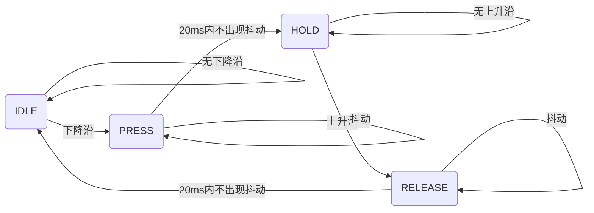

<center><font size=“8>FPGA开发微沙龙————键盘篇</font></center>
<center>自动化系科协硬件部</center>

0. 如何使用VS Code打开verilog文件（*.v）
tools->option->preferred text editor->Custom->"**route_to_your_vscode**/Code.exe"%f

# 键盘开发讲解

## 一、矩阵键盘的结构、引脚、扫描和工作原理
<div style="text-align: right;">自31 谢嘉晟</div>
主要内容：4*4按键键盘的结构和CLK扫描的实现

### 1. 什么是矩阵键盘？

矩阵键盘是一种常见的输入设备，按键按照行和列的方式排列，通过将按键接入到行和列的交叉点，节省了引脚的使用。它广泛应用于嵌入式系统、电子设备和工业控制等领域。

---

### 2. 矩阵键盘的硬件结构


#### 2.1 矩阵键盘的物理布局

- 按键通常排列成 **行 (Rows)** 和 **列 (Columns)** 的网格结构。
- 行和列分别连接到对应的引脚。

#### 2.2 引脚设计

- **列引脚 (Columns)**：输入电平信号。
- **行引脚 (Rows)**：检测行引脚信号是否变化。
- 例如，4x4 矩阵键盘有 4 个行引脚和 4 个列引脚，共需 8 根线。

---

### 3. 矩阵键盘的工作原理

- 每个按键位于某一行和某一列的交叉点。
- 按键按下时，闭合了行和列之间的电路。
- 程序通过检测 **哪一行与哪一列连接** 来判断按下的按键。

---

### 4. 矩阵键盘的扫描方法

#### 4.1 列扫描法

- 每次激活一列，将其电平拉低（或拉高）。
- 检查所有行的电平状态，如果某列电平变化，说明该列的按键被按下。

#### 4.2 扫描步骤

1. 激活第一列，检查列状态。
2. 激活第二列，重复检查。
3. 按照顺序扫描所有列，定位按键位置。

---

### 5. 按键编码

通过行列编号，可以为每个按键分配一个唯一值。  

例如，对于一个 4x4 的键盘：

| 行\列 | C0  | C1  | C2  | C3  |
|-------|------|------|------|------|
| R0    | 1    | 2    | 3    | A    |
| R1    | 4    | 5    | 6    | B    |
| R2    | 7    | 8    | 9    | C    |
| R3    | *    | 0    | #    | D    |

---

### 6. 消抖的必要性与实现

#### 6.1 为什么需要消抖？

按键按下或释放时，物理触点会引起信号的抖动，导致多个高低电平的变化。

#### 6.2 软件消抖

- 检测到按键变化后，延时一段时间（如 10ms）。
- 再次检测，确保状态稳定。

#### 6.3 硬件消抖

- 在按键电路中加入电容或滤波器。

---

### 7. 矩阵键盘的接口与控制
- 矩阵键盘通常与单片机/嵌入式系统的 GPIO 口相连。
- 行引脚设置为输出，列引脚设置为输入，检测电平变化。

---

### 8. 实例：矩阵键盘检测代码

以下是使用 Verilog 实现矩阵键盘扫描的核心逻辑：

```verilog
always @(posedge CLK or negedge nRST)
    if(!nRST)
        KEY_ROW <= 4'b0000;
    else begin
        KEY_ROW <= 4'b1110; // 激活第一行
        if(KEY_COL != 4'b1111) begin
            // 读取列状态，判断按键位置
        end
    end
```

初始化：设定行（R1, R2, R3, R4）和列（C1, C2, C3, C4）为输入输出模式
设定行引脚为高电平，列引脚为低电平

开始扫描：
    对每一列 C
        激活列 C（设置为低电平，其他列设置为高电平）
        读取所有行的状态
        对每一行 R
            如果该行 R 对应的列 C 为低电平
                记录按键 R-C 被按下
        等待短时间去抖动（去抖动处理）
        
    如果没有按键被按下，退出扫描

## 二、键盘防抖处理 
<div style="text-align: right;">自34 蒲明康</div>
主要内容：如何通过程序防止干扰信号对于键盘输出的影响

### 2.1.为什么需要按钮防抖

如图1所示，我们所使用的按键开关为机械弹性开关，当机械触点断开、闭合时，由于机械触点的弹性作用，一个按键开关在闭合时不会马上稳定地接通，在断开时也不会一下子断开。因而在闭合及断开的瞬间均伴随有一连串的抖动，为了不产生这种现象而做的措施就是按键消抖。按键抖动原理图如图2所示。


抖动时间的长短由按键的机械特性决定，一般为5ms~10ms。按键稳定闭合时间的长短则是由操作人员的按键动作决定的，一般为零点几秒至数秒。按键抖动会引起一次按键被误读多次。为确保控制器对按键的一次闭合仅作一次处理，必须去除按键的抖动。在按键闭合稳定时读取按键的状态，并且必须判别到按键释放稳定后再作处理 。

消抖是为了避免在按键按下或是抬起时电平剧烈抖动带来的影响。按键的消抖，可用硬件或软件两种方法。我们这里采用软件的方法。同时，软件消抖的方式大致分为两种，一种是直接通过产生延时的方式来实现，等候抖动消失后再检测按键的状态；另一种是通过有限状态机的方法来实现。我们详细讲述第二种方式。

### 2.2有限状态机实现按钮防抖

#### 状态定义

要使用状态机进行按键消抖首先要把按键从按下，抖动，到最终稳定的过程分为四个状态

> IDLE：空闲状态，按键未被按下
> PRESS：按键被按下过程中的抖动状态
> HOLD：按下保持的状态，按键确认按下
> RELEASE：按键松开过程中的抖动状态

#### 逻辑思路

按键结构：


- IDLE：初始化后进入IDLE状态。进入IDLE状态后如果检测到**下降沿**则进入PRESS状态，同时开始计数。
- PRESS：如果在20ms内没有检测到**上升沿**（抖动）就进入HOLD状态。否则（出现抖动）返回PRESS状态，并且计时器清0重新计数，继续等待边沿，重复上述操作。
- HOLD：进入HOLD状态后如果检测到**上升沿**，就进入RELEASE状态，同时开始计数。
- RELEASE：如果在20ms内没有检测到**下降沿**（抖动）就返回IDLE状态。否则（出现抖动）返回HOLD状态，并且计时器清0重新计数，继续等待边沿，重复上述操作。

#### 状态转移图



#### 输入输出端口

输入端口：
> 时钟信号 clk
> 复位信号 rst_n（一般后面_n是低电平有效的标志）
> 按键输入信号 key_in

输出信号：
>按键状态 key_state（时刻反映按键的状态）
>按键标志 key_flag （当确认按下后会产生一个时钟周期的脉冲）

#### 各功能模块

一共需要四个模块：
> [输入缓存模块](#输入缓存模块)：防止按键信号与时钟信号不同步时产生输入信号不稳定而可能出现竞争冒险现象（这一模块一般可以略去）
> [边沿检测模块](#边沿检测模块)：检测按键输入信号出现的下降沿与上升沿
> [计时模块](#计时模块)：用于在PRESS与RELEASE的状态进行计时，以判断是否转移至稳定状态
> [状态机模块](#状态机模块)：状态转换的核心部分

#### verilog实现部分

##### 输入缓存模块

```verilog伪代码
- 如果复位信号有效（~rst_n）:
     - key_1 = 0
     - key_2 = 0
   - 否则:
     - key_1 = key_in
     - key_2 = key_1
```

##### 边沿检测模块

```verilog伪代码
- 如果复位信号有效（~rst_n）:
     - key_last = 0
     - key_now = 0
   - 否则:
     - key_last = key_now
     - key_now = key_2

   - 计算:
     - pedge = key_now AND NOT key_last  (正边沿)
     - nedge = NOT key_now AND key_last  (负边沿)
```

##### 计时模块

```verilog伪代码
 - 如果复位信号有效（~rst_n）:
     - cnt = 0
   - 否则:
     - 如果 encnt:
       - cnt = cnt + 1
     - 否则:
       - cnt = 0

   - 如果计时器满（cnt == 999999）:
     - cnt_full = 1
     - encnt = 0
   - 否则:
     - cnt_full = 0
```

##### 状态机模块

```verilog伪代码
- 如果复位信号有效（~rst_n）:
     - state = IDLE
     - key_state = 1
     - key_shaking = 0
   - 否则，根据当前状态（state）执行相应的逻辑：
   
     - **IDLE 状态**:
       - key_shaking = 0
       - key_state = 1
       - 如果 nedge（负边沿）:
         - state = PRESS
         - encnt = 1
       - 否则:
         - state = IDLE
         - encnt = 0

     - **PRESS 状态**:
       - key_shaking = 1
       - key_state = 1
       - 如果 cnt_full（计时器满）:
         - state = HOLD
         - encnt = 0
       - 否则，如果 pedge（正边沿）:
         - state = PRESS
         - encnt = 1
         - cnt = 0
       - 否则:
         - state = PRESS
         - encnt = 1

     - **HOLD 状态**:
       - key_shaking = 0
       - key_state = 0
       - 如果 pedge（正边沿）:
         - state = RELEASE
         - encnt = 1
       - 否则:
         - state = HOLD
         - encnt = 0

     - **RELEASE 状态**:
       - key_shaking = 1
       - key_state = 0
       - 如果 cnt_full（计时器满）:
         - state = IDLE
         - encnt = 0
       - 否则，如果 nedge（负边沿）:
         - state = PRESS
         - encnt = 1
         - cnt = 0
       - 否则:
         - state = RELEASE
         - encnt = 1
```

## 三、仿真与测试 
<div style="text-align: right;">自35 胡延</div>
主要内容：使用modelism对工程文件进行仿真和调试

#### 测试策略

- 确保设计验证完整性和有效性的关键步骤。需根据设计的复杂性、目标功能编写testbench。

1. 时序逻辑、控制单元、接口信号

2. 激励信号选择
- 随机激励
- 最小值、最大值及其临界点附近（信号的最小/最大幅度，时钟频率的极限等）
- 其他常见场景

3. 时序测试点的选择（如同步电路、时钟域跨越等）
- 时钟沿变化、信号稳定性、复位信号


### 方法一

与功能仿真几乎一样，重点在于将"Generatenetlist for functional simulation"选项设置成off（默认关闭，之前功能仿真时可能打开了）
和写testbench的过程。

1. 以键盘防抖为例，写如下testbench代码用于测试，保存为"project_tb.v"文件:
```testbench
`timescale 1ns / 1ps

module shakingfilter_tb;

    // Inputs
    reg clk;
    reg rst_n;
    reg key_in;

    // Outputs
    wire key_state;
    wire key_shaking;

    // Instantiate the Unit Under Test
    shakingfilter uut (
        .clk(clk),
        .rst_n(rst_n),
        .key_in(key_in),
        .key_state(key_state),
        .key_shaking(key_shaking)
    );

    // Clock generation (50MHz)
    initial begin
        clk = 0;
        forever #10 clk = ~clk;  // 20ns cycle, 50MHz
    end

    // Test sequence
    initial begin
        // Initialize Inputs
        rst_n = 0; key_in = 0;

        // Reset the system
        #100;
        rst_n = 1; 
        #100;

        // Test pressing and releasing the key
        #200 key_in = 1;  // Press the key
        #40000000 key_in = 0; // Release the key after 40ms

        // Continue to test the behavior in rapid succession
        #10000000 key_in = 1;  // Press the key again after 10ms
        #20000000 key_in = 0;  // Release after 20ms

        #10000000 key_in = 1;  // Press again after 10ms
        #10000000 key_in = 0;  // Release after 10ms

        // Allow some time for observing the final states
        #50000000;  // Wait for 50ms
        $finish;  // End simulation
    end

endmodule

endmodule
```

2. 用Quartus II打开项目工程。选择"Settings"→"EDA Tool Settings"，选择左栏的"Simulation"。
-   "Tool name": ModelSim-Altera
-   勾选"Run Automatically"选项
-   "Format for output netlist": Verilog_HDL
-   "Time Scale": 1ns
-   "More EDA Netlist WritterSettings…": 
        将"Generatenetlist for functional simulation"选项设置成off（默认关闭，之前功能仿真时可能打开了）
-   "NativeLink Settings"->"Compile test bench"->"test benches"->"new"->"Filename:Add..."->"**route_to_your_testbench**/project_tb.v"
-   注意testbench名称是"project_tb",一定要加_tb，否则无法正常仿真，会出现很多奇奇怪怪的问题
-   完成设置后进行全编译,系统自动打开Modelism并开始仿真。

### 方法二（了解，比较麻烦）

第二种方法步骤上要多一些,大致的过程就是先在Quartus II中生成网表文件和时延文件，然后直接调用ModelSim，在其中进行配置，然后启动仿真。

#### 需要的文件
1. 综合后生成的Netlist文件"*.vo"
2. 综合后生成的具有工程延时信息的文件"*.sdo"
3. Test Bench程序文件
4. Altera的元器件库

#### 具体步骤

1. 用Quartus II打开项目工程。选择"Settings"→"EDA Tool Settings"，选择左栏的"Simulation"。
-   "Tool name": ModelSim-Altera
-   "Format for output netlist": Verilog
-   "More EDA Netlist WritterSettings…": 
        将"Generatenetlist for functional simulation"选项设置成off（默认关闭，之前功能仿真时可能打开了）
-   "output directory": 
        输出的网表文件和延时信息文件的存放路径，默认即可。编译成功后生成文件夹simulation/modelsim存放.vo和.sdo文件备用
    完成设置后进行全编译。
-   p.s.左下角task区域会多一项"EDANetlist Writer"。

2. 打开文件夹simulation/modelsim
-   设工程名为project（.v文件为project.v）则仿真需要的两个网表文件是：
-       project.vo
-       project_v.sdo

-   p.s.它们与project_8_1200mv_85c_slow.vo和project_8_1200mv_85c_v_slow.sdo只是命名不同而已，文件的内容其实是一样的。后两个是QuartusII目前新的网表文件的命名方法，文件名标示出了速度等级（-8）、内核电压（1200mv）、温度条件（85℃）以及时序模型（slow）。有TclScript文件是按照旧的命名方法写的，需要兼容它们，故还未取消旧的命名文件方法。如果需要用fast时序模型做仿真,要把vo和sdo文件换为fast。

3. 打开ModelSim软件，新建一个工程；
    
-   接着把刚才生成的.vo和.sdo文件拷贝到目录下面。
-   到QuartusII的安装目录下： \quartus\eda\sim_lib，找到与Cyclone II XXXX208C8对应的.v文件（这个是Altera器件库的库文件，进行时序仿真就是基于这个库文件的）把它也拷贝到仿真工程目录；同时把.v文件和QII安装目录…altera\12.0\quartus\eda\fv_lib\verilog的dffeas.v和dffep.v文件拷贝到目录下面。

4. 返回到ModelSim这个软件界面，在新建工程页面添加刚刚copy的".vo"".v"共5个文件，"Compile"→"Compile All"执行全编译。

5. 在Project区域点右键，"Add to Project"→"Simulation Configuration"，进行如下设置：

-   在"Design"选项卡下展开work前面的"+"号后点选project（名称），这个就是Test Bench文件。
-   再切换到"SDF"选项卡，点击"Add"添加".sdo"文件，点击浏览后会直接出现这个".sdo"文件的，选择即可，在下面的"Apply to Region"内输入"U"，这个就是我们的Test Bench程序中例化顶层文件的例化名字。接着把下面的两个SDF选项的复选框都选中。

最后，双击Simulation执行仿真即可。

参考链接：
1. **Modelism时序仿真调试**：https://blog.csdn.net/weixin_44212493/article/details/88688471
2. [[野火]FPGA Verilog开发实战指南](https://doc.embedfire.com/fpga/altera/ep4ce10_pro/zh/latest/code/key_filter.html#id2)
3. [「知乎」按键的硬件消抖电路原理详解](https://zhuanlan.zhihu.com/p/639763135)
4. [「知乎」小白零基础学习FPGA笔记——按键消抖](https://zhuanlan.zhihu.com/p/353554209?utm_id=0)