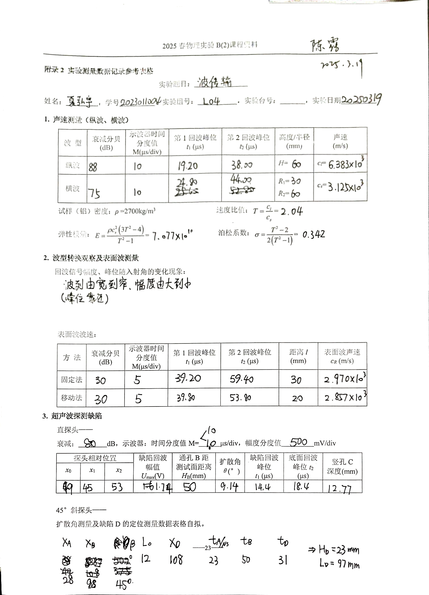

# 超声波在固体中的传输 - 实验报告

## 基本信息

- ​**姓名**: 夏弘宇
- ​**学号**: 2023011004
- ​**实验日期**: 2025年3月19日
- ​**实验组/台号**: L4

## 实验目的

1. 掌握超声波在固体中传播时的波速测量方法。
2. 观察超声波不同波型的转换。
3. 学习超声波探测的基本原理及应用。

## 实验仪器

- 超声波试验仪
- 超声试验仪衰减器
- 直探头、斜探头、可变角探头
- 测试样、纯净水

## 数据处理

### 1. 声速测量

**方法**: 脉冲波反射法

**公式**: $c_l = \frac{2H}{t_2-t_1}, c_s = \frac{2(R-r)}{t_2-t_1}$

| 波型  | 衰减分贝 (dB) | 示波器时间 分度值 M(μs/div) | 第1回波峰位 $t_1$(μs) | 第2回波峰位 $t_2$(μs) | 高度/半径 (mm)         | 声速 (m/s)                |
| --- | --------- | ------------------- | ---------------- | ---------------- | ------------------ | ----------------------- |
| 纵波  | 88        | 10                  | 19.20            | 38.00            | H=60               | $c_l=6.383 \times 10^3$ |
| 横波  | 75        | 10                  | 24.80            | 44.00            | $R_1=30$\\$R_2=60$ | $c_s=3.125 \times 10^3$ |

**试样(铝)密度**: ρ=2700 kg/m³

**速度比值**:  $T = \frac{c_l}{c_s} = 2.04$

**弹性模量**:  $E = \frac{\rho c_s^2 (3 T^2 - 4)}{T^2 - 1} = 7.077 \times 10^{10} \, \text{Pa}$

**泊松系数**:  $\sigma = \frac{T^2 - 2}{2 (T^2 - 1)} = 0.342$

### 2. 波型转换观察及表面波测量

**回波信号幅度、峰位随入射角的变化现象**:  波列由宽到窄、幅度由大到小（峰位靠近）

**表面波波速**:$c_R = \frac{2L}{t_2-t_1}$

| 方法  | 衰减分贝 (dB) | 示波器时间分度值 M(μs/div) | 第1回波峰位 $t_1$(μs) | 第2回波峰位 $t_2$(μs) | 距离l (mm) | 表面波声速 $c_R$(m/s)    |
| --- | --------- | ------------------ | ---------------- | ---------------- | -------- | ------------------- |
| 固定法 | 30        | 5                  | 39.20            | 59.40            | 30       | $2.970 \times 10^3$ |
| 移动法 | 30        | 5                  | 39.80            | 53.80            | 20       | $2.857 \times 10^3$ |

### 3. 超声波探测缺陷

#### 3.1 直探头

**衰减**: 80 dB ；**示波器**: 时间分度值 M=10 μs/div，幅度分度值 500 mV/div

**公式**：

- 扩散角：$\theta = 2\arctan\frac{x_2-x_1}{2H_B}$

- 缺陷深度：$H = 0.5c_l \times (t_2-t_1)$

| 探头相对位置$x_0(mm)$ | 探头相对位置$x_1(mm)$ | 探头相对位置$x_2(mm)$ | 缺陷回波 幅值 $U_{max}$(V) | 通孔B距 测试面距离 $H_B$(mm) | 扩散角 θ(°) | 缺陷回波 峰位 $t_1$(μs) | 底面回波 峰位 $t_2$ (μs) | 竖孔C深度(mm) |
| --------------- | --------------- | --------------- | -------------------- | -------------------- | -------- | ----------------- | ------------------ | --------- |
| 49              | 45              | 53              | 1.74                 | 50                   | 9.14     | 14.4              | 18.4               | 12.77     |

#### 3.2 45°斜探头

| 探头相对位置$x_A(mm)$ | 探头相对位置$x_B(mm)$ | 折射角$\beta(°)$ | 探头相对位置$x_D(mm)$ | 入射点到探头前沿的距离$L_0(mm)$ | A孔回波峰位缺陷回波 峰位 $t_A$(μs) | B孔回波峰位缺陷回波 峰位 $t_B$(μs) | D孔回波峰位缺陷回波 峰位 $t_D$(μs) |
| --------------- | --------------- | ------------- | --------------- | -------------------- | ----------------------- | ----------------------- | ----------------------- |
| 28              | 88              | 45            | 108             | 12                   | 23                      | 50                      | 31                      |

 公式：

- $\beta = \tan^{-1}\left(\frac{(x_B-x_A)-(L_B - L_A)}{L_B - L_A}\right)$

- $L_0 = H_B \tan \beta + L_B - x_B$

- $\frac{H_D-H_A}{t_D-t_A} = \frac{H_B-H_A}{t_B-t_A}$可解得$H_D = 23mm$

- $L_D = x_D + L_0 - H_D tan\beta = 97mm$ 

## 实验总结

本次实验主要分为声速测量与缺陷探测两大类任务，原理主要是几何关系与速度关系，难度在于调整探头使得幅度最大，需要反复调整。

缺陷探测的时候，尤其是用斜探头是，难点在于将波峰与响应的缺陷对应起来；这还得与直观上的距离远近来判断不同缺陷对应波峰的相对位置，方便判断。

通过本次实验，我掌握了超声波在固体中传播时的波速测量方法，以及通过示波器探测金属缺陷的方法。感谢助教老师在实验过程中对我的悉心指导与帮助，受益匪浅！

## 原始数据记录

