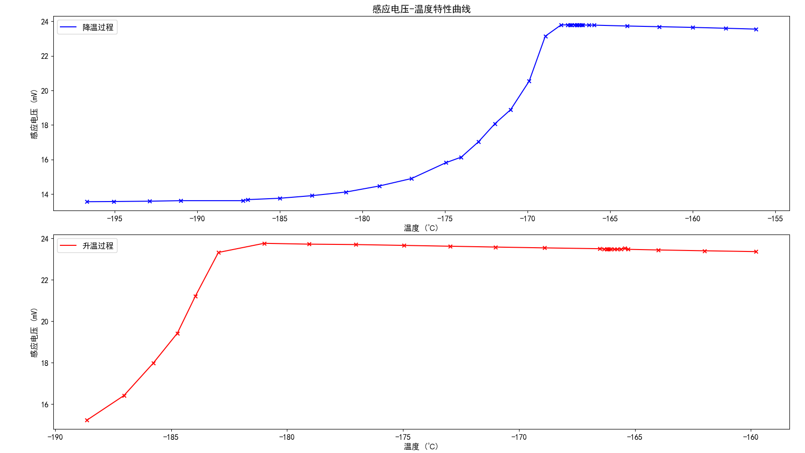

# 测定高温超导材料的转变温度 - 实验报告

## 基本信息

- ​**姓名**: 夏弘宇
- ​**学号**: 2023011004
- ​**实验日期**: 2025年4月16日
- ​**实验组/台号**: L4

## 实验目的

1. 掌握超导体的基本特性及其与理想导体的区别
2. 学习使用液氮冷却技术和四引线法测量超导材料的电阻-温度特性
3. 通过电磁感应法观察超导体的完全抗磁性现象

## 实验仪器

- 稳压稳流直流电源
- 信号发生器
- 数字万用表（五位半/四位半）
- 液氮罐及低温测试装置
- 超导样品及测量探头
- 铂电阻温度计
- 四引线法测量组件
- 电磁感应线圈组
- 铜质均温块
- 实验导线及连接器
- 安全防护设备

## 数据处理与分析

### 1.计算铂电阻阻值$R_t$、及超导样品电阻$R_{Super}$

#### 1.1 铂电阻阻值和温度计算

根据铂电阻的标准特性，其电阻值$R_t$与温度$t$之间的关系可由以下标准方程表示：

$$
R_t = R_0 \cdot (1 + At + Bt^2)
$$

其中，$R_0$是0℃时的电阻值，$A$和$B$是常数。对于温度计算，我们使用反向公式：

$$
t = \frac{-A + \sqrt{A^2 - 4B(1-0.01R_t)}}{2B}
$$

其中：

$A = 3.9083 \times 10^{-3} \ ℃^{-1}$
$B = -5.775 \times 10^{-7} \ ℃^{-2}$
本实验中，铂电阻阻值由测量电压$U_t$直接表示，简化处理时将$R_t$视为与$U_t$成正比。

#### 1.2 超导样品电阻计算

超导样品的电阻采用四引线法测量，考虑乱真电势的影响，计算公式为：

理论上，$U_{meas} = \frac{U_{meas1} + U_{meas2}}{2}$，其中$U_{meas1}$和$U_{meas2}$分别为样品两端的电压测量值。

但测两次太麻烦了，本次实验中直接用超导态的乱真电势$U_{spur}$来修正电压$U_{meas}$，计算超导样品电阻$R_{Super}$：

$$
R_{Super} = \frac{U_{Super}}{I} = \frac{U_{meas} - U_{spur}}{I}
$$

其中：

- $U_{meas}$是测得的样品电压
- $U_{spur}$是样品进入超导态后的乱真电势，$U_{spur} = \frac{U_{meas1} - U_{meas2}}{2}$
- $I$是通过样品的恒定电流（本实验中为1mA）
  乱真电势$U_{spur}$取值为0.021mV，此值在样品完全进入超导态后测得。

### 2. 铂电阻阻值和超导样品电阻数据

选取在超导转变温度附近约±10℃范围内的数据点：

#### 2.1 升温过程数据

| 铂电阻阻值(Rt)/mV | 温度(T)/℃ | 超导样品电阻(R_super)/Ω |
| ------------ | ------- | ----------------- |
| 24.22        | -188.64 | -0.001            |
| 24.88        | -187.04 | -0.001            |
| 25.40        | -185.78 | -0.002            |
| 25.83        | -184.73 | -0.001            |
| 26.15        | -183.96 | -0.002            |
| 26.56        | -182.96 | -0.002            |
| 27.37        | -180.99 | -0.002            |
| 28.17        | -179.05 | -0.002            |
| 29.00        | -177.03 | -0.002            |
| 29.85        | -174.97 | -0.002            |
| 30.67        | -172.97 | -0.002            |
| 31.47        | -171.02 | -0.003            |
| 32.34        | -168.90 | -0.003            |
| 33.32        | -166.51 | -0.002            |
| 33.39        | -166.34 | -0.001            |
| 33.44        | -166.22 | 0.005             |
| 33.45        | -166.20 | 0.025             |
| 33.48        | -166.12 | 0.025             |
| 33.51        | -166.05 | 0.038             |
| 33.58        | -165.88 | 0.052             |
| 33.63        | -165.76 | 0.075             |
| 33.69        | -165.61 | 0.077             |
| 33.76        | -165.44 | 0.078             |
| 33.82        | -165.29 | 0.078             |
| 34.35        | -164.00 | 0.081             |
| 35.17        | -162.00 | 0.082             |
| 36.08        | -159.78 | 0.084             |

#### 2.2 降温过程数据

| 铂电阻阻值(Rt)/mV | 温度(T)/℃ | 超导样品电阻(R_super)/Ω |
| ------------ | ------- | ----------------- |
| 20.89        | -196.70 | 0.000             |
| 21.57        | -195.05 | 0.001             |
| 22.46        | -192.90 | 0.001             |
| 23.24        | -191.01 | 0.001             |
| 24.80        | -187.23 | 0.000             |
| 24.91        | -186.96 | 0.000             |
| 25.72        | -185.00 | -0.001            |
| 26.52        | -183.06 | -0.001            |
| 27.37        | -180.99 | -0.001            |
| 28.20        | -178.98 | -0.002            |
| 29.00        | -177.03 | -0.002            |
| 29.86        | -174.94 | -0.002            |
| 30.24        | -174.02 | -0.003            |
| 30.67        | -172.97 | -0.002            |
| 31.08        | -171.97 | -0.003            |
| 31.47        | -171.02 | -0.003            |
| 31.93        | -169.90 | -0.003            |
| 32.33        | -168.93 | -0.003            |
| 32.72        | -167.98 | -0.003            |
| 32.89        | -167.56 | -0.002            |
| 32.95        | -167.42 | 0.003             |
| 32.98        | -167.34 | 0.014             |
| 33.06        | -167.15 | 0.024             |
| 33.11        | -167.03 | 0.038             |
| 33.12        | -167.00 | 0.028             |
| 33.17        | -166.88 | 0.046             |
| 33.23        | -166.73 | 0.054             |
| 33.26        | -166.66 | 0.062             |
| 33.41        | -166.29 | 0.075             |
| 33.54        | -165.98 | 0.078             |
| 34.36        | -163.98 | 0.081             |
| 35.16        | -162.02 | 0.083             |
| 35.99        | -160.00 | 0.085             |
| 36.81        | -157.99 | 0.086             |
| 37.56        | -156.16 | 0.088             |

### 3. 电阻-温度特性曲线分析

为了研究超导样品的超导转变特性，我们绘制了电阻-温度(R-T)曲线，如下图所示：

从R-T曲线可以观察到以下特征：

降温过程：随着温度降低，样品电阻在-167℃左右开始急剧下降，最终趋近于零，表明样品进入超导状态。

升温过程：随着温度升高，样品电阻在-166℃左右开始急剧上升，表明样品从超导状态过渡到正常导电状态。

滞后效应：升温和降温过程的转变温度略有不同，表现出温度滞后现象，这是超导体相变的典型特征。

### 4. 感应电压-温度特性曲线分析

为研究超导体的抗磁性，绘制了感应电压-温度(Um-T)曲线：

从Um-T曲线可以观察到：

降温过程：随着温度降低，当接近-168℃时，感应电压发生显著变化，这是由于超导样品开始排斥外部磁场（迈斯纳效应）。

升温过程：随着温度升高，当接近-183℃时，感应电压又开始恢复到原来的水平，表明超导体的抗磁性随着温度升高而消失。

这一现象证实了超导体的完全抗磁性（迈斯纳效应），即超导体处于超导态时能够完全排斥外部磁场。

### 5. 超导转变温度与转变宽度确定

超导转变参数采用以下标准确定：

- 转变起始温度(T_onset)：电阻值下降到最大值90%的温度点
- 转变结束温度(T_end)：电阻值下降到最大值10%的温度点
- 转变中点温度(T_middle)：电阻值下降到最大值50%的温度点
- 转变宽度(ΔTc)：T_onset与T_end之间的温度差
  根据升温过程数据计算得到：

$$
T_c = -167.00 \ ℃
$$

$$
\Delta T_c = 3.44 \ ℃
$$

- 根据降温过程数据计算得到：

$$
T_c = -166.05 \ ℃
$$

$$
\Delta T_c = 0.61 \ ℃
$$

### 6. 结果讨论

超导转变温度：实验获得的超导样品转变温度约为-167℃(106K)，与高温超导材料YBaCuO的典型转变温度范围相符。

迈斯纳效应：感应电压-温度曲线在超导转变点附近的明显变化证实了样品在超导态下具有完全抗磁性。

温度滞后现象：升温和降温过程中超导转变温度的差异表明超导相变具有一阶相变的特性。

转变宽度：得到的转变宽度较小，表明样品具有较高的均匀性和纯度。

通过本实验，我们成功观测并测量了高温超导材料的超导转变特性，验证了其零电阻和完全抗磁性的基本特征。

## 实验总结

本次实验成功测定了高温超导材料的转变温度，并观察到其零电阻和完全抗磁性现象。通过液氮冷却技术和四引线法测量超导样品的电阻-温度特性，获得了超导转变温度约为-167℃(106K)，并分析了感应电压-温度特性曲线，验证了迈斯纳效应。实验结果表明，所用超导材料具有良好的超导性能，且转变宽度较小，表明样品均匀性较高。

还有一个小问题：零电阻与抗磁性两者出现并不同时，这个问题还有待思考。

这次实验的机会挺难得的，知道了液氮也没想象中那么可怕，而是可以当做开水那样倒的，当然科学的操作对于有危险性的操作还是很重要的。通过实验，我对超导现象有了更深入的理解，尤其是超导转变温度和迈斯纳效应的观察。最后感谢助教的悉心指导。

## 原始数据记录

